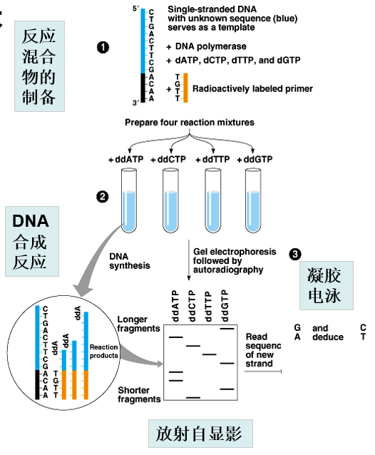
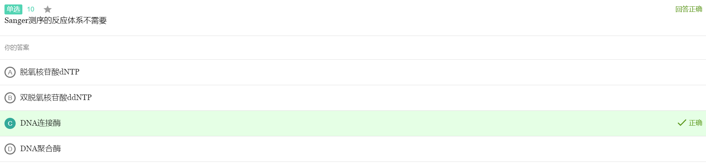
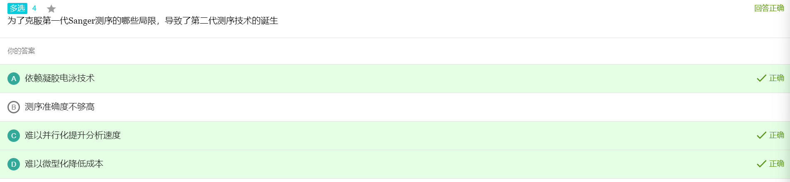
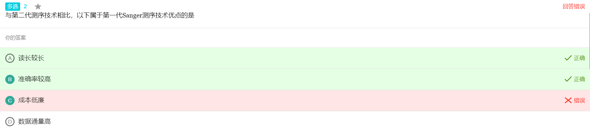
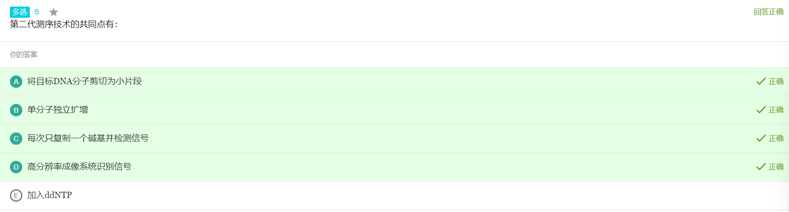
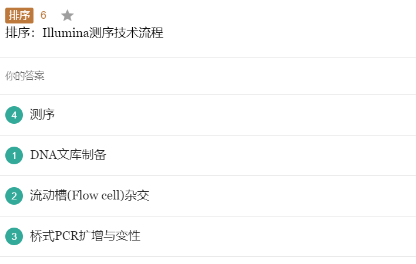
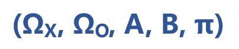

## 测序技术

1. 分离待测核酸模板
2. 在反应体系中添加适当的引物、模板、DNA聚合酶、dNTP及带有荧光标记的ddNTP
3. 进行DNA合成反应
4. 凝胶电泳分离反应产物
5. 放射自显影

Sanger测序，双脱氧链终⽌法。就是ddNTP在DNA合成过程中不能形成磷酸⼆酯键，从⽽中断DNA的合成反应，然后就能产⽣⼀些列不同⻓度的DNA，然后进⾏变形聚丙烯酰胺凝㬵电泳和放射⾃显影就⾏了。注意读的时候要从下往上读，因为越轻的dna⽚段跑得越快

一代测序 测不长

1.电泳不能跑太久；2. 电泳对大片段分辨率有限；3. 信号会逐渐衰减（>900 bp还不终止的序列已经比较少）

Sanger的局限
通过⼏⼗年的改进，第⼀代测序仪的读⻓可以超过1000 bp，原始数据的准确率可以⾼达99.99%，测定每千碱基序列的成本是0.5美元，每天的数据通量可以达到60万碱基。但是，不管怎么改进，第⼀代测序技术在速度和成本⽅⾯都已达到了极限，因为需要序列扩增及对电泳分离技术的依赖（ 难集成 ），使其难以进⼀步提升分析的速度和难以提⾼ 并⾏化 程度，并且难以通过 微型化 降低测序成本。在此种情况下，第⼆代测序技术（Next-generation sequencing）应运⽽⽣。

读长较长   准确率高

⼆代测序技术的共同点

1. 将⽬标DNA剪切为⼩⽚段
2. 单分⼦独⽴扩增
3. 每次只复制⼀个碱基并检测信号
4. ⾼分辨率的成像系统

1. DNA文库制备
2. 流动槽杂交
3. 桥式PCR扩增与变形
4. 测序

⼆代测序的局限
第⼀代测序仪相⽐，以合成测序为基础的下⼀代测序平台速度显著提⾼，成本明显降低。每台设备每天产出100 Gb碱基的序列不⾜为奇。
但是，读⻓短成了下⼀代测序平台的致命伤，这主要是由于DNA簇中存在的光学信号移相造成的。另外，由于需要序列扩增，不同⻓度的⽚段也不容易实现均⼀扩增。

1. 无法对核酸序列直接测序
2. 测序读段长度较短
3. 存在一定的测序错误

三代测序技术(PacBio SMRT  &  Oxford Nanopore)

⽐较⼀、⼆、三代测序的优缺点
⼀代
读⻓>1000，准确率99.99%，序列扩增及对电泳分离技术的依赖（ 难集成 ），使其难以进⼀步提升分
析的速度和难以提⾼ 并⾏化 程度，并且难以通过 微型化 降低测序成本。
测不⻓的原因是

1. 电泳不能跑太久；
2. 电泳对⼤⽚段分辨率有限；
3. 信号会逐渐衰减（>900 bp还不终⽌的序列已经⽐较少）。
   ⼆代
   集成化、并⾏化、微型化、测不⻓，慢（⽐1快），采⽤克隆扩增后的核酸进⾏测定。
   三代
   1.⻓读⻓
   2.单分⼦测序，⽆需扩增
   3.可检测碱基修饰
   4.连续测序，速度快（取决于所⽤聚合酶的速度或通过纳⽶孔的速度）
   5.便携（Nanopore）
   6.错误率较⾼（近年有突破，部分产品测序准确率已>99%）
   7.存在系统错误，对同聚物（如AAAAAAA）识别有问题
   8.通量⽐⼆代测序低，成本⽐⼆代测序⾼，尚不适合定量分析
   总结
   第⼀代测序技术：读⻓⻓，通量低，准确度最⾼，成本⾼
   第⼆代测序技术：读⻓短，通量⾼，准确度较低，成本低
   第三代测序技术：读⻓超⻓， 通量较低但产出数⾼ ，准确度低，成本⾼

## 生信数据库

## 双序列比对

## 多序列比对与分子进化分析

## 基因组拼接和其他比对算法

## 隐马科夫模型和基因组注释

马可夫性：过程的将来仅依赖于现在

隐马尔可夫模型 (HMM) 是一个五元组，必有五个模型参数：

* 状态集（隐藏状态）：状态的有限集合
* 转移概率矩阵
* 观测集：观察值的有限集合
* 输出概率矩阵
* 初始状态分布

HMM参数λ = {π, A, B}

解决三个基本问题：

* 评估问题(Evaluation)
  * 给定模型，求某个观察值序列的概率p(σ|λ)
* 解码问题(Decoding)
  * 对于给定模型和观察值序列，求可能性最大的状态序列
* 学习问题(Learning)
  * 对于给定的一个观察值序列，调整参数λ，使得观察值出现的概率p(σ|λ)最大

对应三种算法：

* 评估问题(由因求果)：**向前算法**
* 解码问题(执果寻因)：**Viterbi算法**
* 学习问题(因果循环)：**向前向后算法** （了解）

  * EM算法的一个特例，带隐变量的最大似然估计（又分为有监督和无监督学习）

## 基因定位和全基因组关联分析

## 基因芯片和表达谱分析

## 蛋白质性质和结构分析
