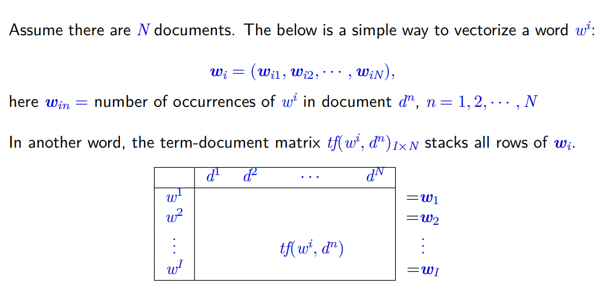

## TF-IDF简要介绍

TF-IDF(term frequency–inverse document frequency)，一种常用于挖掘文章中关键词的加权技术。**某个词在文章（一篇文章或者某类文章）中的TF-IDF越大，那么一般而言这个词在这篇文章的重要性会越高** ，可以作为其一个特征

TF-IDF(词频-逆文档频率)=TF * IDF

### 词频（TF）

表示词条（关键字）在文本中出现的频率 ,通常会被归一化(一般是词频除以文章总词数)。



上述没有统一标准化词频，用来展现特定主题文章下特定词语出现的次数。

### **逆文档频率 (IDF)**  

某一特定词语的IDF，可以由 **总文件数目除以包含该词语的文件的数目** ， **再将得到的商取对数得到** 。


## TF-IDF计算的伪代码

```
# 定义文档集合
documents = [...]

# 计算词频TF
def computeTF(wordDict, doc):
    tfDict = {}
    corpusCount = len(doc)
    for word, count in wordDict.items():
        tfDict[word] = count / float(corpusCount)
    return tfDict

# 计算逆文档频率IDF
def computeIDF(docList):
    import math
    idfDict = {}
    N = len(docList)
  
    idfDict = dict.fromkeys(docList[0].keys(), 0)
    for doc in docList:
        for word, val in doc.items():
            if val > 0:
                idfDict[word] += 1
  
    for word, val in idfDict.items():
        idfDict[word] = math.log10(N / float(val))
      
    return idfDict

# 计算TF-IDF
def computeTFIDF(tfBagOfWords, idfs):
    tfidf = {}
    for word, val in tfBagOfWords.items():
        tfidf[word] = val * idfs[word]
    return tfidf

```

## NLTK实现TF-IDF计算

```

from nltk.text import TextCollection
from nltk.tokenize import word_tokenize
 
#首先，构建语料库corpus
sents=['this is sentence one','this is sentence two','this is sentence three']
sents=[word_tokenize(sent) for sent in sents] #对每个句子进行分词
print(sents)  #输出分词后的结果
corpus=TextCollection(sents)  #构建语料库
print(corpus)  #输出语料库
 
#计算语料库中"one"的tf值
tf=corpus.tf('one',corpus)    # 1/12
print(tf)
 
#计算语料库中"one"的idf值
idf=corpus.idf('one')      #log(3/1)
print(idf)
 
#计算语料库中"one"的tf-idf值
tf_idf=corpus.tf_idf('one',corpus)
print(tf_idf)
```


TextRank算法在新冠相关文献文本分析中的应用主要体现在以下几个方面：

1. [ **关键词提取** ：TextRank算法可以用于从大量的新冠相关文献中提取关键词](https://zhuanlan.zhihu.com/p/55270310)。这些关键词可以帮助研究者快速理解文本的主题，从而更有效地浏览和理解大量的文献。
2. [ **文本摘要** ：TextRank算法也可以用于生成文本摘要](https://zhuanlan.zhihu.com/p/55270310)。在处理新冠相关文献时，TextRank可以帮助我们快速识别出文本的主题，从而更有效地浏览和理解大量的文献。
3. [ **信息检索** ：在信息检索中，TextRank算法可以用于评估文档的重要性，从而提高搜索引擎的效率](https://zhuanlan.zhihu.com/p/55270310)。
4. [ **知识图谱构建** ：在知识图谱构建中，TextRank算法可以用于从文本中提取实体和关系，从而构建知识图谱](https://zhuanlan.zhihu.com/p/55270310)。

## 参考

[Lexicon Computing 基本词汇计算 (wordpress.com)](https://hzaubionlp.files.wordpress.com/2023/09/jingboslides_nlp.-lexicon_computingefbc8826ppefbc89.pdf)

[盘点 KeyBert、TextRank 等九种主流关键词提取算法原理及 Python 代码实现 - 知乎 (zhihu.com)](https://zhuanlan.zhihu.com/p/568271135)
