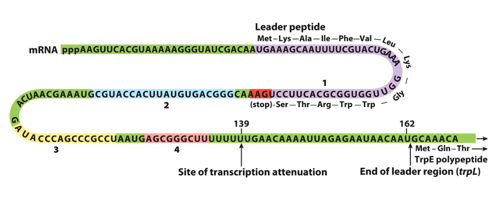

molecular bioogy

1953年，DNA双螺旋结构模型的提出作为现代分子生物学诞生的里程碑

传统PCR主要步骤

1. **变性（Denaturation）** : 对双链DNA模板进行加热，使其解离成两条单链DNA
2. **退火（Annealing）** : 将温度降低至特定温度，从而使所加引物与模板DNA复性结合,引物与目标DNA的侧翼区域结合
3. **延伸（Extension）** : DNA聚合酶沿着模板链将**引物3’端**进行延伸

pcr反应体系

1. 模板DNA
2. 前后引物
3. 缓冲液
4. 四种dNTP
5. Taq DNA酶

**试比较遗传信息传递过程中,原核生物和真核生物mRNA的特征差异**

原核生物和真核生物的mRNA在遗传信息传递过程中存在许多差异。以下是它们的主要特征差异：

1. **转录后修饰** : 在真核生物中，mRNA在转录后需要经过多种修饰，如5’端加帽、3’端加尾、剪接等，才能成为成熟mRNA，而原核生物的mRNA则不需要这些修饰
2. **半衰期** : 原核生物的mRNA半衰期通常较短，而真核生物的mRNA半衰期则较长
3. **多肽编码** : 原核生物的mRNA有时可以同时编码几个多肽，而真核生物的mRNA则通常只编码一个多肽.
4. **剪接** : 在真核生物中，mRNA需要经过剪接才能成为成熟的mRNA，而原核生物的mRNA则不需要剪接
5. **起始密码子** : 在原核生物中，mRNA的起始密码子通常是AUG，而在真核生物中，mRNA的起始密码子则可以是AUG以外的其他密码子

**人类基因组包含2万多个基因,然而却可以编码出不少于20万个不同的蛋白质。根据所学知识,简要分析为什么。**

* 基因组中的基因也可以通过不同的翻译起始位点、不同的翻译后修饰等方式产生不同的蛋白质. 这些机制使得基因组中的基因可以编码出更多的蛋白质，从而增加了生物体的复杂性和适应性。
* RNA水平的可变剪切增加基因组多样性。同一个基因可以通过多种方式进行表达，从而产生多种不同的蛋白质。例如，同一个基因可以通过剪接产生不同的mRNA，进而编码出不同的蛋白质。
* 肽链修饰和剪切是蛋白质的后翻译修饰方式之一。多亚基相互组合成蛋白质，这种组合方式可以通过肽链修饰和剪切来调节。

**在基因组组装过程中,端粒序列一般比较困难,请问真核生物染色体的端粒如何在DNA复制过程中保持稳定遗传?**

端粒是真核生物染色体末端的一段DNA与蛋白质的复合体，其功能是维持染色体末端的完整性，而端粒的结构和功能是由端粒酶和端粒蛋白复合物( shelterin) 共同维持的。

* 端粒在DNA复制过程中的稳定遗传主要依赖于端粒酶的作用。端粒酶可以在端粒序列的5′末端添加重复单位来将其延长，从而防止端粒缩短。
* 端粒蛋白复合物shelterin还可以通过抑制DNA损伤应答机制，保护端粒免受DNA损伤的影响。这些机制共同作用，使得端粒在DNA复制过程中能够保持稳定遗传。

## 染色体与DNA

### 真核细胞染色体

组蛋白与非组蛋白

* 组蛋白

  * 结构蛋白
  * 富含Arg、Lys而呈碱性、可与酸性的DNA紧密结合
  * 五组分：H1、H2A、H2B、H3、H4
  * 特性
    * 进化上的极端保守性
    * 无组织特异性
    * 肽链上氨基酸分布的不对称性
    * 组蛋白的修饰作用
    * 富含赖氨酸的组蛋白H5
* 非组蛋白

  * 具有多样性、异质性，不同组织细胞中其种类和数目都不相同
  * 包括以DNA为底物的酶、作用于组蛋白的酶

真核生物基因组结构特点：

* 基因组庞大
* 大部分为非编码序列
* 真核基因使断裂基因，有内含子
* 存在大量的DNA多态性
* 存在大量顺式作用元件
* 转录产物为单顺反子(一条mRNA中只含有一个翻译起始点和一个终止点，编码一个基因片段)

### 核小体和染色质

* 核小体 染色体DNA一级包装
* 染色质纤维（30nm fiber）——二级包装
* 染色质纤维环——三级结构

DNA二级结构

* 由两条相互平行的脱氧核苷酸长链盘绕而成
* 脱氧核糖和磷酸交替连接，排在外侧，构成基本骨架，碱基排列在内侧
* 两条链上的碱基通过氢键结合，按一定的规律形成碱基对
* 具有特殊的空间结构

### DNA复制

DNA聚合酶：以亲代DNA为模板，催化底物dNTP分子聚合形成子代的一类酶

DNA酶：切断DNA磷酸二酯键的酶

外切酶：可水解分子链内部磷酸二酯键生成寡核苷酸的酶

内切酶：从多核苷酸链的一端开始按序催化水解3、5-磷酸二酯键，降解核苷酸

大肠杆菌中三种主要DNA聚合酶共同点：

* 都以dNTP为底物
* 聚合时必须由模板链和具有3'-OH末端的引物链
* 都需要Mg2+激活
* 链的延伸方向都是5'->3'

大肠杆菌 DNA聚合酶Ⅰ

* 具有5’-3’DNA合成能力
* 具有5’-3’单链DNA外切酶活性
* 具有3’-5’单链DNA外切酶活性

大肠杆菌 DNA聚合酶Ⅲ

* 具有5’-3’DNA合成能力
* 具有3’-5’单链DNA外切酶活性

DNA复制子关键元件：

* 复制起点
* 复制终点

真核生物DNA复制

* 半保留复制
* 半不连续复制
* 主要有DNA聚合酶I完成复制

DNA聚合酶的催化活性：

* 5'-3' DNA外切酶活性
* 3'-5' DNA外切酶活性
* 5'-3' DNA聚合酶活性

**细菌、 病毒 和 真核细胞 的染色体上含有一段可在 基因组 中移动的DNA片段** ，这种转移称之为转座

## 转录

DNA模板链 与 对应产物

RNA转录特点：

* 5'-3'
* 以DNA双链中反义链为模板
* 由RNA聚合酶催化
* AUGC
* 不需要引物

### RNA

* RNA作为信息分子，可贮藏以及转移遗传信息
* RNA作为功能分子，是蛋白质生物合成的主要参与者，是核酶的主要成分，参与基因表达的调控，还可以作为遗传物质

RNA局部的茎环结构形成不需要酶催化

真核生物基因组中有内含子、外显子、插入序列，没有质粒

水平基因转移是原核生物基因组演化的主要驱动力。

### 真核生物mRNA

内含子是阻断基因线性表达的序列，在成熟mRNA被保留下来的基因部分被称为外显子

真核细胞mRNA加工修饰

* 切除内含子，连接外显子
* 5'接上帽子
* 3'添加ploy尾(多聚A尾巴)

5'帽子功能

* 保护mRNA，使mRNA免遭核酸的破坏
* 能被小亚基识别，促使mRNA和核糖体的结合，是mRNA翻译所必需的

3'多聚A尾巴

* 多聚腺核苷酸对mRNA的成熟是必要的
* ployA是mRNA由细胞核进入细胞质所必须的形式
* 对mRNA有翻译作用
* 多聚腺核苷酸尾巴至少可以起某种缓冲作用，防止核酸外切酶对mRNA信息序列的降解作用
* mRNA刚进入胞质时，ployA尾巴较长，随时间推移将变短直至消失，随后mRNA将降解

基因转录

RNA拼接共有4种方式

* 核mRNA的拼接体的拼接
* 类型I自我拼接
* 类型II自我拼接
* 核tRNA的酶促拼接

### 原核生物mRNA

影响原核生物启动子强度：

* -35区序列
* -10区序列
* -10区和-35区的最佳距离

σ因子

抑制转录：DNA模板功能抑制剂、RNA聚合酶抑制剂

## 翻译

以mRNA为模板合成蛋白质多肽链的过程

### 遗传密码（三联子）

三联体密码：mRNA上每三个核苷酸翻译成蛋白质多肽链上的一个氨基酸

ORF：结构基因的正常核苷酸序列，从起始密码子到终止密码子的阅读框可编码完整的多肽链，期间不存在是翻译中断的终止密码子

遗传密码的性质

* 连续性
* 通用性
* 简并性
* 摇摆性
* 偏好性

改变遗传密码的几类突变

沉默突变不会改变所编码的蛋白序列

* 无义突变

  * DNA的突变引起mRNA中的密码子改变为一种终止密码子
* 错义突变

  * DNA的突变引起mRNA中密码子改变为另一种氨基酸
* 移码突变

  * DNA分子由于某位点碱基的缺失或插入，引起阅读框变化造成下游一系列密码改变

终止密码子 UGA

真核生物中，起始密码子除AUG外，还包括GUG和UUG

真核生物mRNA、真核生物tRNA、原核生物tRNA需要经过剪切

### 蛋白质的运输和降解

#### 转运类型

* 共翻译转运：蛋白质在核糖体上合成，蛋白质的合成和转运是同时发生的（分泌蛋白）
* 翻译后转运：蛋白质在游离核糖体上合成，合成完毕从核糖体上释放后才发生转运（线粒体、叶绿体蛋白）
  * 线粒体蛋白的靶向输送
  * 细胞核蛋白的靶向输送

信号肽：新生分泌蛋白的N端有保守的氨基酸序列，引导运输被转运入ER内腔蛋白质的信号肽

蛋白磷酸化和生命活动相关：

* 细胞信号转导
* 细胞凋亡
* 转录调节
* DNA损伤修复

组蛋白甲基化和乙酰化会引起：

* 染色质构象改变
* 基因表达差异
* 核小体形成或解离

## 原核生物基因表达调控

### 正调控

* 有调节蛋白或者调节蛋白被激活时，基因正常表达
* 没有调节蛋白或调节蛋白失活时，基因不表达

### 乳糖操纵子

原核生物中,一个体系在需要时被打开,不需要时被关闭。这种"开-关"(on-off)活性是通过调节转录来建立的,也就是说mRNA的合成是可以被调节的

**以乳糖操纵子模型为例,论述原核生物如何协调正负调控,精确调控特定基因mRNA的合成,进而实现对营养物质分解代谢有关的酶的浓度调节,来响应外界营养条件变化。**

乳糖操纵子是参与乳糖分解的一个基因群，由乳糖系统的阻遏物和操纵序列组成，使得一组与乳糖代谢相关的基因受到同步的调控。乳糖操纵子的结构模式包括三个结构基因、启动子、终止子及操纵基因，其中lacZ、lacY及lacA是阻遏物，lacO是启动子，lacP是操纵序列。

1. 乳糖操纵子为分解代谢调控，包含着乳糖和cAMP-CAP正负协调调控
2. 当外界存在葡萄糖时，cAMP-CAP正调控未激活，即使乳糖解除阻遏，整体酶基因表达量较低
3. 当外界葡萄糖耗尽，有乳糖存在。首先是乳糖结合阻遏蛋白后脱离基因，解除转录阻遏，开始下游基因表达，合成分解酶利用乳糖。
4. 没有葡萄糖，细胞内cAMP浓度会增加，激活CAP调控蛋白，促进下游乳糖分解酶基因大量表达。

乳糖操纵子的负调控是乳糖缺少时，阻遏蛋白与操纵基因结合，不能与DNA转录，阳性调控是乳糖存在时，操纵基因与RNA聚合酶结合，启动基因转录。CAP是一种被cAMP诱导的激活蛋白，在细胞内葡萄糖含量高时，能量供应充足，cAMP含量降低，基因表达被抑制；当细胞内葡萄糖不足时，cAMP含量升高，CAP被激活，结合在原核启动子的-10区并结合RNA聚合酶促使下游基因转录，可促进一些无-35区启动子调控的基因表达。这样就造成了当葡萄糖和其它糖类一起作为细菌的碳源时葡萄糖总是优先被利用的现象。

#### CAP位点

* RNA聚合酶结合位点
* DNA结合位点
* cAMP结合位点

#### 阻遏蛋白

* 无乳糖时，发挥负调控作用
* 阻遏物是别乳糖

### 色氨酸操纵子

* 5个结构基因共有启动子和终止子
* 5个结构基因共被调控
* 5个结构基因没有色氨酸 被表达

简单终止子转录出RNA后，两段富含GC的片段会形成茎环结构，破坏了RNA和模板DNA的杂合双链结构。

3+4区域形成得到茎环结构符合终止子特征

### 阿拉伯糖操纵子

* ara操纵子受CAP-cAMP调控
* 有阿拉伯糖，没有葡萄糖，结构基因高表达

原核生物中，一些mRNA非编码区的序列折叠成一定的构象，这些构象的改变可应答于体内的一些代谢分子、离子浓度或温度等，从而通过这些构象的改变达到调节mRNA转录的目的

影响原核基因表达效率

* 启动子结构

### 转录水平基因表达调控

σ因子调节

σ因子，非专一性蛋白，作为所有 RNA聚合酶 的辅助因子起作用

* σ因子帮助核心酶识别启动子，不是RNA链延伸必需的
* σ因子通过降低核心酶与非特异序列的亲和力,和增加其与启动子的亲和力来帮助核心酶识别启动子
* 新生RNA链达到6-9个核苷酸，形成稳定的酶-DNA-RNA复合物时，o因子释放
* 无σ因子的核心酶也能在DNA模板上合成RNA，但不能正确地起始转录

组蛋白类似蛋白

转录因子

抗终止因子

原核生物调控基因表达往往是为了应答环境条件(例如,温度,渗透压或者是否存在某种营养物质)的改变或者细胞内部的生理状况(例如为细胞分裂做准备)的变化。与细胞适应过程有关的酶或者蛋白质通常是不存在的,只有在需要的时候才被合成。

**原核核生物中许多调控RNA(如sRNA)可参与多种基因的表达调控,请简述sRNA调控基因表达的常见作用方式**

原核生物中的sRNA是一种短小的非编码RNA，通常长度在50-500nt之间，它们可以通过与mRNA结合，从而影响mRNA的翻译或降解，从而调控基因表达。sRNA调控基因表达的常见作用方式包括以下几种：

1. **mRNA的降解** : sRNA与mRNA结合后，可以通过RNA酶的介入，导致mRNA的降解，从而抑制基因表达.

   * sRNA直接作用于其靶mRNA的SD序列和(或)编码区，引起翻译的直接抑制或与靶mRNA结合后引起该双链RNA分子对RNaseIII的敏感性增加，使其降解
2. **mRNA的翻译抑制** : sRNA与mRNA结合后，可以阻止mRNA与核糖体的结合，从而抑制mRNA的翻译，从而抑制基因表达.

   * sRNA与mRNA的SD序列的上游非编码区结合，从而抑制靶mRNA的翻译功能。其作用机制可能是sRNA与靶mRNA的上游序列结合后阻止了核糖体的结合。
3. **mRNA的转录抑制** : sRNA可直接抑制靶mRNA的转录。sRNA和mRNA有不完全的互补序列，可以形成双链的RNA杂交体。而在mRNA上紧随杂交区之后的是一段U丰富区。其结构类似于终止子结构，从而使转录开始不久后即终

* mRNA能指导蛋白合成，sRNA不能
* 转录没有明显区别

## 真核生物基因表达调控

真核生物表达调控

真核细胞一基因表达调控最明显的特征是在特定时间，特定的细胞中特定的基因被激活，实现“预定”的、有序的、不可逆转的分化、发育，并使生物的组织和器官保持正常功能。这是生命活动规律决定的，环境因素在其中作用不大

* 瞬时调控或称可逆性调控
* 发育调控或称不可逆调控
  or
* 转录水平调控
* 转录后水平调控 (RNA加工成熟过程的调控，翻译水平的调控，蛋白质加工水平的调控)

### 真核基因表达的转录水平调控

基因转录调节的基本要素包括顺式作用元件(cis-acting element)、反式作用因子(trans-acting factor)和RNA聚合酶

#### 顺式作用元件

* 启动子
* 增强子
* 沉默子

**顺式作用元件 (cis-acting element)是存在于基因旁侧序列中，能影响基因表达的一段DNA序列** ，它们的作用是参与基因表达的调控；顺式作用元件本身不编码任何蛋白质，仅仅提供一个作用位点，要与反式作用因子（多是转录组因子）相互作用而起作用。

### 真核基因表达的染色质修饰和表观遗传调控

#### DNA甲基化

主要设计正调控

#### 组蛋白甲基化

可 正 可 负 调控

#### 组蛋白乙酰化

正调控

组蛋白的乙酰化能中和赖氨酸的正电荷，能够增加与DNA的斥力，使得DNA结构变得疏松，从而导致基因的转录活化。基因可及性提高

#### 非编码RNA真核基因表达调控

Dicer和Ago蛋白共同的结构域 PAZ结构域

siRNA

* siRNA介导的基因沉默机制
  * RISC中，siRNA引导链的5‘端与AGO蛋白的MID结合，延伸MID/PIWI界面至3’端与PAZ特异性结合
  * siRNA的2-8 nt为种子序列，用于与靶标特异性配对
  * mRNA-siRNA配对物位于PIWI功能域由PIWI催化将靶标mRNA切断，并使切断的mRNA离开RISC
* siRNA的生物学意义
  * 在转录水平和转录后水平参与基因的表达调控
  * 维持基因组的稳定
  * 保护基因组免受外源核酸的入侵

**真核生物中参与基因表达调控的RNA，比较短的有siRNA、miRNA、piRNA等,比较长的如长链非编码(lncRNA)。一般认为lncRNA是长度大于200nt的非编码RNA。根据所学知识,请总结真核生物中常见的lncRNA种类及其作用方式。**

长链非编码RNA（lncRNA）是一类长度超过200nt的非编码RNA分子，其缺乏开放阅读框（ORF），无编码蛋白质功能。根据其相对于蛋白质编码基因的相对位置，将其分为以下5类

1. **基因间lncRNA（intergenic lncRNA，lincRNA）** ：从两个蛋白质编码基因之间的DNA序列转录。
2. **基因内lncRNA**
3. **正义lncRNA（sense lncRNA）** ：转录方向与蛋白质编码基因方向相同。
4. **反义lncRNA（antisense lncRNA）** ：转录方向与蛋白质编码基因方向相反。
5. **增强子IncRNA**
6. 环状IncRNA

lncRNA具有非常重要的调控功能，且几乎参与到了各种生物学过程和通路，与各种疾病的发生发展紧密关联. lncRNA的作用方式包括以下几种:

作为

1. 信号分子 表达与结合的转录因子或者信号途径相关 基因调控时空特异性
2. 诱饵分子 将转录因子或相关的其他类型蛋白带离染色质或将其带入染色质的核心区域
3. 引导分子 招募染色质修饰酶对靶基因调控，顺式或反式方式对远距离靶基因表达调控
4. 骨架分子
   1. 作为中心平台招募相关生物学过程的分子
   2. 结合多种蛋白质形成RNP(核糖核蛋白复合体)
   3. 复合体进一步作用影响组蛋白修饰

色氨酸操纵子基因表达调控

负调控蛋白和衰减子共同控制

生物体内的基因根据表达的状况可分为管家基因和奢侈基因  对应表达量以及调控

真核生物中,一个基因要正常表达,可能要经过一系列的调控过程。这些调控过程主要发生在哪些层级,每个层级主要的调控方式是什么样的?

1. 转录水平，通过顺式作用元件的开启关闭，以及小分子结合转录因子，来调控基因的表达时空

真核生物中，一个基因要正常表达，需要经过多个层级的调控。这些层级包括：

1. **染色质水平调控** : 染色质结构的改变会影响基因的可及性，从而影响基因的转录。染色质水平调控的主要方式包括组蛋白修饰、DNA甲基化、染色质重塑等
2. **转录水平调控** : 转录因子的结合与启动子的甲基化状态等因素会影响基因的转录。转录水平调控的主要方式包括转录因子的结合、启动子甲基化状态的改变等
3. **转录后水平调控** : 包括RNA剪接、RNA编辑、RNA稳定性、RNA转运等，如对翻译得到的mRNA进行可变剪切，甲基化修饰等调控，影响后续的表达过程
4. **翻译水平调控** : 包括mRNA的选择性翻译、翻译后修饰等
5. **表观遗传调控** : 包括DNA甲基化、组蛋白修饰等.
6. **非编码RNA调控** : 包括miRNA、siRNA、lncRNA等.
