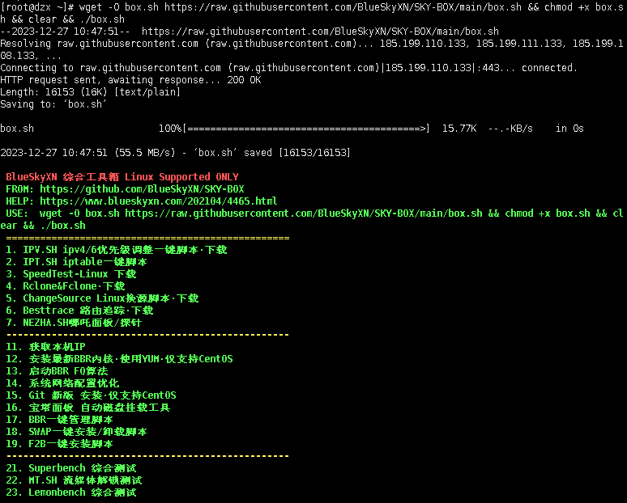
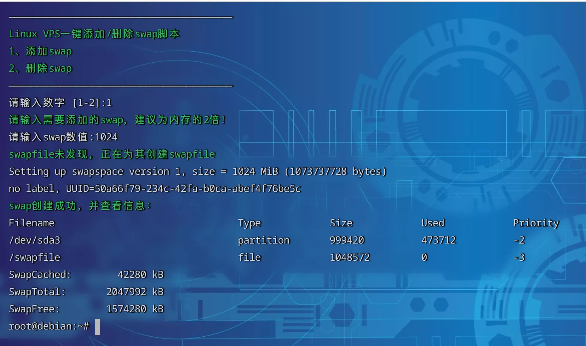
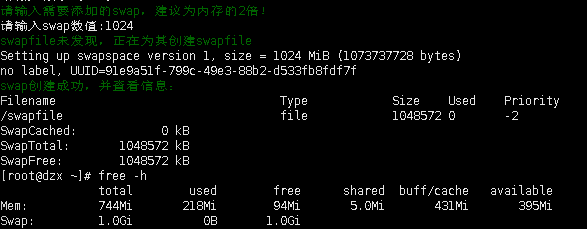

## 安装Docker和Nginx Proxy Manager

### 添加swap虚拟内存

    VPS 的内存如果过小，建议设置一下 SWAP，一般为内存的 1-1.5 倍即可，可以让系统运行更流畅！

```shell
wget -O box.sh https://raw.githubusercontent.com/BlueSkyXN/SKY-BOX/main/box.sh && chmod +x box.sh && clear && ./box.sh
```

```plaintext
1. wget -O box.sh https://raw.githubusercontent.com/BlueSkyXN/SKY-BOX/main/box.sh： 使用wget工具从给定的URL下载一个文件，并将其保存为box.sh。-O box.sh参数指定了输出文件的名称。

2. chmod +x box.sh：这个命令改变了box.sh文件的权限，使其变为可执行。+x表示添加执行（x）权限。

3. clear：清空终端的屏幕

4. ./box.sh：这个命令执行了box.sh脚本。./表示当前目录，所以./box.sh就是执行当前目录下的box.sh文件。

5. 使用&&连接，当且仅当前一个命令成功执行后才执行后面的命令
```



输入数字18，选择设置SWAP



设置swap数值，并使用 `free -h`查看内存设置情况



### 升级packages

因为密码管理器是我新服务器下第一个项目，先升级安装常用的软件

```shell
sudo -i #切换至root用户
```

Debian或者Ubuntu都是基于Debian的linux发行版，常用apt作为包管理器

```shell
apt update -y 

apt install wget curl sudo vim git -y
```

我因为手边有一本鸟叔的Linux工具书，选择了和书中一致的CentOS,应该使用yum或者dnf作为包管理器

```shell
yum update -y

yum install wget curl sudo vim git -y
```

### 安装Docker环境

#### 安装Docker (境外VPS)

```
wget -qO- get.docker.com | bash
```

-q 下载过程中静默下载，不输出下载信息

-O- 下载内容输出值stdout,直接给后面bash命令执行

```shell
docker -v #查看docker版本，判断是否安装成功
```

```shell
systemctl enable docker #设置成开机自启动
```

#### 安装docker-compose

Linux 上我们可以从 Github 上下载它的二进制包来使用，最新发行的版本地址：[https://github.com/docker/compose/releases](https://github.com/docker/compose/releases)

运行以下命令以下载 Docker Compose 的当前稳定版本：(尝试v2.2.2没有报错，最新版v2.4报错)

```shell
sudo curl -L "https://github.com/docker/compose/releases/download/v2.2.2/docker-compose-$(uname -s)-$(uname -m)" -o /usr/local/bin/docker-compose
```

将可执行权限应用于二进制文件：

```shell
sudo chmod +x /usr/local/bin/docker-compose
```

创建软链：（`/usr/bin`通常在系统的PATH环境变量中，使 `docker-compose`可以全局运行）

```shell
sudo ln -s /usr/local/bin/docker-compose /usr/bin/docker-compose
```

测试是否安装成功：

```shell
[root@dzx bin]# docker-compose version
Docker Compose version v2.2.2
```

#### 修改Docker配置

* 增加一段自定义内网 IPv6 地址
* 开启容器的 IPv6 功能
* 限制日志文件大小，防止 Docker 日志塞满硬盘
  ```shell
  cat > /etc/docker/daemon.json <<EOF
  {
      "log-driver": "json-file",
      "log-opts": {
          "max-size": "20m",
          "max-file": "3"
      },
      "ipv6": true,
      "fixed-cidr-v6": "fd00:dead:beef:c0::/80",
      "experimental":true,
      "ip6tables":true
  }
  EOF
  ```

重启Docker服务:`systemctl restart docker`

## Nginx Proxy Manager

### 安装Nginx Proxy Manager

```shell
sudo -i

mkdir -p /root/data/docker_data/npm

cd /root/data/docker_data/npm
```

直接使用docker安装

```shell
cat > docker-compose.yml <<EOF
version: '3'
services:
  app:
    image: 'jc21/nginx-proxy-manager:latest'
    restart: unless-stopped
    ports:
      - '80:80'  # 保持默认即可，不建议修改左侧的80
      - '81:81'  # 冒号左边可以改成自己服务器未被占用的端口
      - '443:443' # 保持默认即可，不建议修改左侧的443
    volumes:
      - ./data:/data # 冒号左边可以改路径，现在是表示把数据存放在在当前文件夹下的 data 文件夹中
      - ./letsencrypt:/etc/letsencrypt  # 冒号左边可以改路径，现在是表示把数据存放在在当前文件夹下的 letsencrypt 文件夹中
EOF
```

### 运行访问Nginx Proxy Manager


