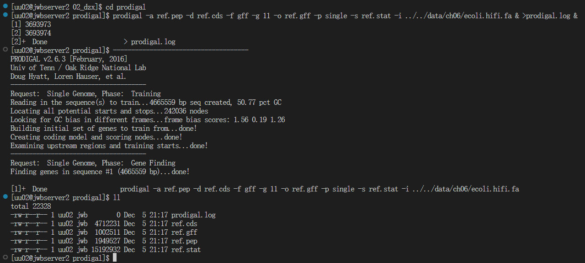
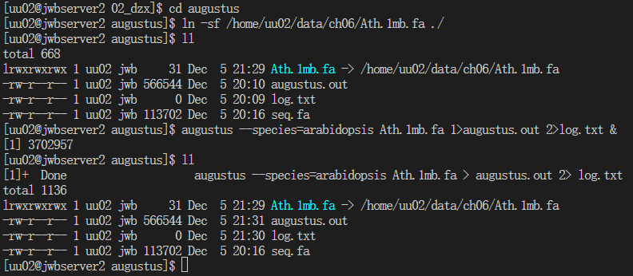
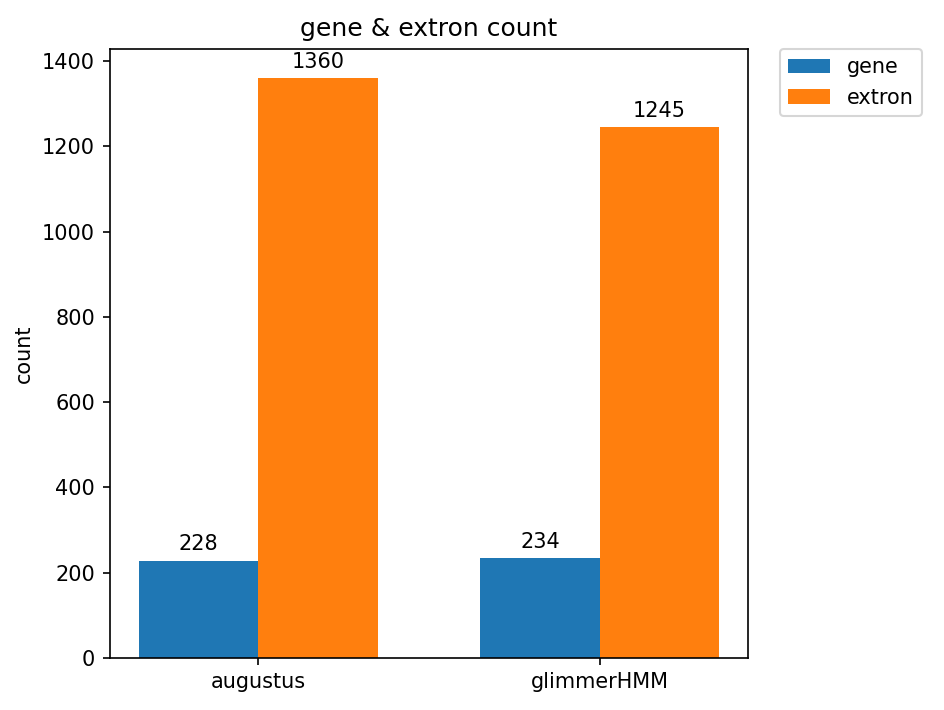
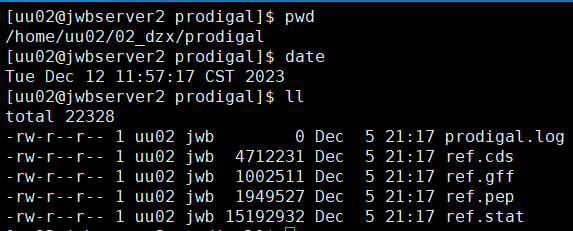
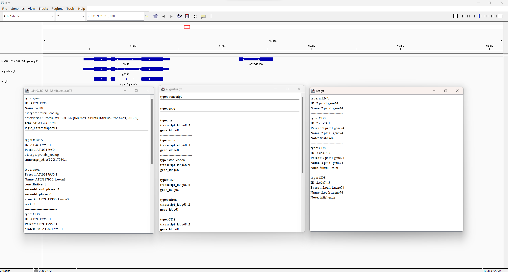

# **生物信息软件综合实践实验报告**

## **实验题目** ：基因预测和基因结构分析

实验日期：2023年12月5日 星期二

实验者：生物信息2102代子希

## **实验目的：**

1.掌握常用基因从头预测软件的使用和结果解读

2.熟悉文件格式GFF3的基本信息

3.熟悉至少一种基因组浏览器的使用

4.了解基因结构和非编码基因预测等分析

## **实验内容：**

1.使用软件Prodigal预测大肠杆菌Escherichia coli K12基因组的基因，并对预测结果进行总结

2.至少使用两种基因从头预测软件预测拟南芥基因组（部分序列）的基因，并对预测结果进行总结和差异比较。

3.使用IGV查看拟南芥重要基因的注释结果

## 实验流程和结果

问题1

1.使用Prodigal对组装的大肠杆菌的序列（其中1Mb序列，已提供，见文件ecoli.hifi.fa）进行基因预测，统计预测得到的基因的数量

**步骤1**：使用prodigal命令

```shell
mkdir prodigal
cd prodigal
prodigal -a ref.pep -d ref.cds -f gff -g 11 -o ref.gff -p single -s ref.stat -i ../../data/ch06/ecoli.hifi.fa & >prodigal.log &
```



ref.cds 输出的预测基因的序列文件

ref.gff 输出的基因的位置信息gff文件

ref.pep 输出的预测序列的氨基酸文件

### prodigal文件夹下结果


**步骤2**：统计预测得到的基因的数量

①使用awk命令对gff文件进行统计

```shell
awk '/^#/ {next} {if ($3 == "CDS") count++} END {print count}' ref.gff
```

②使用grep命令对ref.cds文件进行统计

```shell
 grep -c ">" ref.cds
```


问题2

2.从给定的拟南芥基因组（TAIR10版本）的某段序列（二号染色体7.5-8.5Mb,文件名：Ath.1mb.fa），完成以下任务：

1) 使用GenScan、Augustus、GlimmerHMM等软件（至少两种软件）预测该序列所包含的蛋白质编码基因。统计不同软件组装得到的基因和外显子（exon）的数量，并选用适当的图表（如直方图）将统计结果进行展示。
2) 从TAIR10网站下载该区间的基因注释信息（已下载到服务器，见文件tair10.ch2_7.5-8.5Mb.genes.gff3），作为标准参考集，试评估第1）题中使用的不同软件预测结果的准确率和召回率等。（可以考虑从基因、exon、CDS等水平上进行比较，比如：对于某个基因，augustus预测的跟tair10的基因重叠区域超过各自注释区间的90%，则认为两者一致，其他exon、CDS的比较，可采用相同标准）
3) 试列举1-2个基因在不同软件和TAIR10中的注释差异情况（结合IGV展示不同软件的注释结果）。可参考的基因：WUS、PHYTOCHROMEB

问题2.1

**步骤1**：使用Augustus预测

对需要使用的数据创建软连接，使用Augustus预测

```shell
cd augustus
ln -sf /home/uu02/data/ch06/Ath.1mb.fa ./
augustus --species=arabidopsis Ath.1mb.fa 1>augustus.out 2>log.txt &
```



步骤2：对组装结果augustus.out统计得到基因和外显子的数量

Augusuts预测结束后得到了 `augustus.out`文件，这个文件本质是一个gff格式的文件，文件前半部分是一些 `#`开头的注释

```shell
# 统计基因的数量
gene_count=$(awk -F '\t' '$3=="gene"' augustus.out | wc -l)

# 统计外显子的数量
exon_count=$(awk -F '\t' '$3=="exon"' augustus.out | wc -l)

# 打印结果
echo "基因的数量: $gene_count"
echo "外显子的数量: $exon_count"
```


**步骤3：**使用GlimmerHMM预测

对需要使用的数据创建软连接，使用GlimmerHMM预测

```shell
cd glimmerhmm
ln -sf /home/uu02/data/ch06/Ath.1mb.fa ./
glimmerhmm Ath.1mb.fa -d /home/uu02/software/07_GlimmerHMM/GlimmerHMM/trained_dir/arabidopsis -g -n 1 1>ref.gff 2>log.txt &
```


**步骤4：**对组装结果ref.gff统计得到基因和外显子的数量

组装结果也是gff文件，观察发现GlimmerHMM 的预测结果将 gene 和 exon 信息写在了 "Note" 属性中,并且 gene 信息在 "mRNA" 类型的行中

```shell
# 统计基因的数量
gene_count=$(awk -F '\t' '$3=="mRNA"' ref.gff | wc -l)

# 统计外显子的数量
exon_count=$(awk -F '\t' '$9 ~ /exon/' ref.gff | wc -l)

# 打印结果
echo "基因的数量: $gene_count"
echo "外显子的数量: $exon_count"
```


**步骤5：**选用适当的图表（如直方图）将统计结果进行展示

```python
import matplotlib.pyplot as plt
import numpy as np

# 设置gene和extron的count
counts = {'augustus': {'gene': 228, 'extron': 1360},
          'glimmerHMM': {'gene': 234, 'extron': 1245}}

# 创建堆叠的直方图
labels = list(counts.keys())
gene_counts = [counts[label]['gene'] for label in labels]
exon_counts = [counts[label]['extron'] for label in labels]

x = np.arange(len(labels))  # the label locations
width = 0.35  # the width of the bars

fig, ax = plt.subplots()
rects1 = ax.bar(x - width/2, gene_counts, width, label='gene')
rects2 = ax.bar(x + width/2, exon_counts, width, label='extron')

#加上具体的数值
for rect in rects1:
    height = rect.get_height()
    ax.annotate('{}'.format(height),
                xy=(rect.get_x()+rect.get_width()/2, height),
                xytext=(0,3),  # 3 points vertical offset
                textcoords="offset points",
                ha='center', va='bottom')
for rect in rects2:
    height = rect.get_height()
    ax.annotate('{}'.format(height),
                xy=(rect.get_x()+rect.get_width()/2, height),
                xytext=(0,3),  # 3 points vertical offset
                textcoords="offset points",
                ha='center', va='bottom')
  
ax.set_ylabel('count')
ax.set_title('gene & extron count')
ax.set_xticks(x)
ax.set_xticklabels(labels)
#图例放在表格外面
ax.legend(bbox_to_anchor=(1.05, 1), loc='upper left', borderaxespad=0.)

fig.tight_layout()

plt.show()
```



### augustus文件夹下结果


#### 部分预测结果


### prodigal文件夹下结果



#### 部分预测结果


问题2.2 不同软件预测结果的准确率和召回率

**步骤1：**使用bedtools intersectbed模块获取重叠部分符合要求的结果

* -a -b  指定输入文件
* -f 0.9 指定重叠部分最少所占比列
* -r 指定重叠部分所占比例在 a 与 b中同时满足 > 0.9

  

```shell
#!/bin/bash

augustus='/home/uu02/02_dzx/augustus/augustus.out'
glimmerHMM='/home/uu02/02_dzx/glimmerhmm/ref.gff'
ref_data='/home/uu02/data/ch06/tair10.ch2_7.5-8.5Mb.genes.gff3'

for file in $augustus $glimmerHMM
do
    dir=$(basename $(dirname $file))
    intersectBed -a $ref_data -b $file -f 0.9 -r -wao > $dir.intersect
done
```

**步骤2：** 文件导入本地，用python统计召回率 ：实际为正的样本中被预测为正样本的概率

召回率=TP/(TP+FN)

实际为正的样本数为 ref_data 参考数据中注释为gene / exon的行

实际为正 统计为真的样本，根据不同软件预测结果格式筛选

augustus: 	gene: `data[(data[11] == 'gene') & (data[2] == 'gene')]` 		exon: ` (data[11] == 'exon') & (data[2] == 'exon')]`

gil mmerhmm:	gene: `data[(data[11] == 'mRNA') & (data[2] == 'gene')]`		exon: `data[(data[2] == 'exon') & (data[17].str.contains('exon'))]`

```python
import os
import pandas as pd

#分别从gene、exon水平通过召回率评估不同软件预测结果
file = ['F:/生物信息软件综合实践/05_data/augustus.intersect', 'F:/生物信息软件综合实践/05_data/glimmerhmm.intersect']
ref_data = pd.read_csv('F:/生物信息软件综合实践/05_data/tair10.ch2_7.5-8.5Mb.genes.gff3', sep='\t', header=None)

ref_data_gene = ref_data[ref_data[2] == 'gene']
ref_data_exon = ref_data[ref_data[2] == 'exon']

for f in file:
    data = pd.read_csv(f, sep='\t', header=None)
  
    software = os.path.basename(f).split('.')[0]
  
    #gene
    g_p_e = len(ref_data_gene)
    e_p_e = len(ref_data_exon)
    if software == 'augustus':
        g_tp = len(data[(data[11] == 'gene') & (data[2] == 'gene')])
        g_recall = g_tp / g_p_e
  
        e_tp = len(data[(data[11] == 'exon') & (data[2] == 'exon')])
        e_recall = e_tp / e_p_e
  
        print('augustus gene recall: %s, and turn to percentage: %s %%' % (g_recall, format(g_recall*100, '.2f')))
        print('augustus exon recall: %s, and turn to percentage: %s %%' % (e_recall, format(e_recall*100, '.2f')))
        #转换成百分比 
    elif software == 'glimmerhmm':
        g_tp = len(data[(data[11] == 'mRNA') & (data[2] == 'gene')])
        g_recall = g_tp / g_p_e
  
        e_tp = len(data[(data[2] == 'exon') & (data[17].str.contains('exon'))])
        e_recall = e_tp / e_p_e
  
        print('glimmerhmm gene recall: %s, and turn to percentage: %s %%' % (g_recall, format(g_recall*100, '.2f')))
        print('glimmerhmm exon recall: %s, and turn to percentage: %s %%' % (e_recall, format(e_recall*100, '.2f')))
```


| recall(召回率) | gene   |  exon  |
| :------------: | ------ | :----: |
|   glimmerhmm   | 12.75% | 58.35% |
|    augustus    | 46.61% | 68.29% |

问题2.3

列举1-2个基因在不同软件和TAIR10中的注释差异情况（结合IGV展示不同软件的注释结果）。可参考的基因：WUS、PHYTOCHROMEB




## 思考与讨论

1.原核生物的基因结构（组成单元、长度、GC含量等）和真核生物的基因结构有哪些差异？（结合大肠杆菌和拟南芥的注释进行分析讨论）

2.不如软件的基因预测结果，有哪些差异？为什么会有这些差异？相比于标准集，哪个软件的预测结果可能相对最好？试结合算法原理，进行讨论

1.原核生物和真核生物的基因结构差异：

* 原核生物（以大肠杆菌为例），原核生物基因没有内含子,一个基因对应一个连续的mRNA和蛋白质，大肠杆菌基因主要由连续的开放阅读框（ORF）组成，其中包含了编码蛋白质的基因。这些基因通常没有被包裹在真正的细胞核中，而是在细胞质中存在。原核生物基因整体较短,大多数大肠杆菌基因长度小于1000bp，典型的蛋白编码基因长度约为几百到几千个碱基对，原核生物基因前的启动子区域保守,存在信号序列如-10和-35元件
* 真核生物（以拟南芥为例），真核生物基因由外显子和内含子组成，外显子为编码蛋白质的区域，而内含子则是非编码序列。这些基因通常位于真正的细胞核中，即真核生物基因含有内含子,需要剪接处理长度：。真核生物基因通常较长，其中包含有复杂的调控元件和结构。蛋白编码基因的长度可能达到数千到数万个碱基对，拟南芥等真核生物基因往往很长,部分基因可达几十万bp。拟南芥等高等真核生物基因区GC含量差异较大。真核生物启动子区域结构较复杂,需多个转录因子互作才能启动转录，真核生物同属基因序列保守性差异大,难以仅依靠序列相关性预测基因

2.基因预测软件结果与实际差异的原因以及算法比较：

* 算法原理:augustus使用生成式隐马尔可夫模型,genscan和glimmerhmm使用隐马尔可夫模型
* 预测内容:augustus可以预测外显子-内含子结构,genscan和glimmerhmm仅预测外显子

因此:

* augustus利用了更丰富的外部信息,理论上预测精度应最高
* genscan和glimmerhmm仅依靠序列本身,难免会漏预测真实基因或者错误预测假基因
* 对于拟南芥这类有丰富注释的数据,以augustus训练得到的模型进行预测效果应最好
* 对于基因组注释不全的物种,三者效果相对,Glimmerhmm可能效果最好

从本次实验计算的召回率以及上述分析，总体来说,利用外部信息(如注释)训练模型进行预测的augustus,在条件允许的情况下,它的预测结果可靠性应最高。
