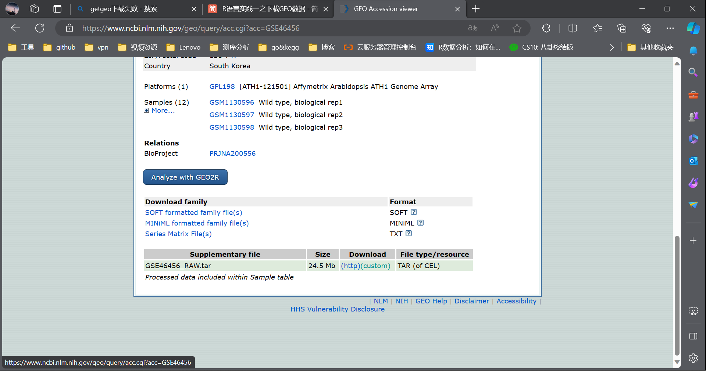
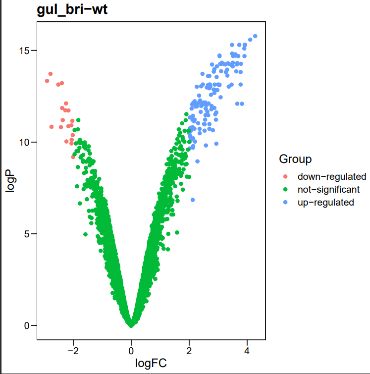
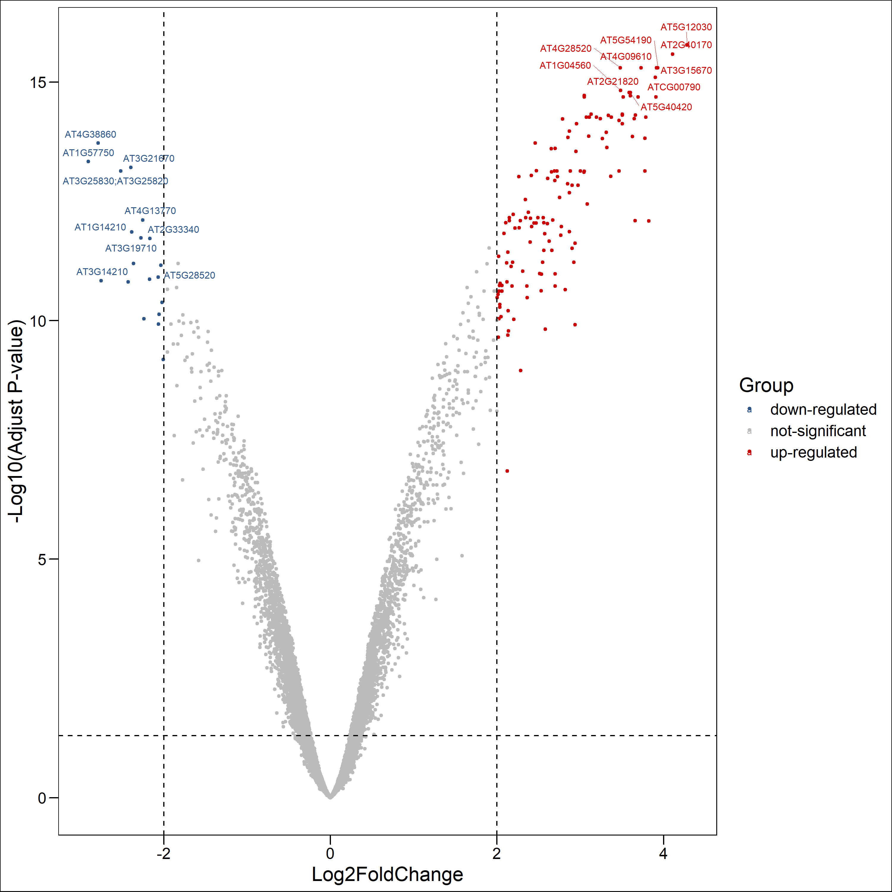
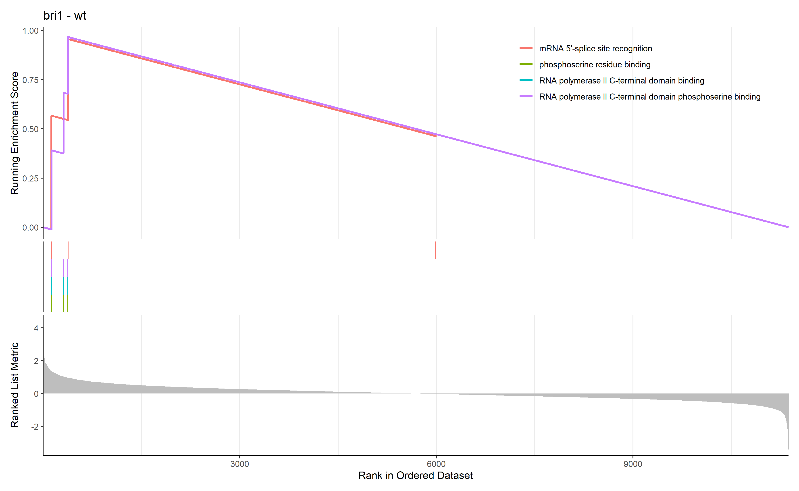
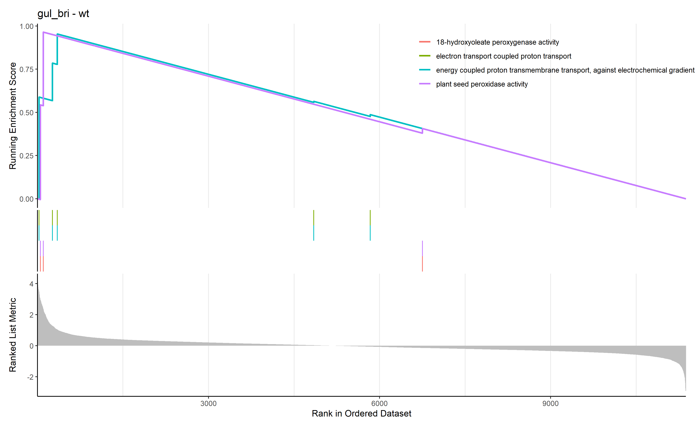
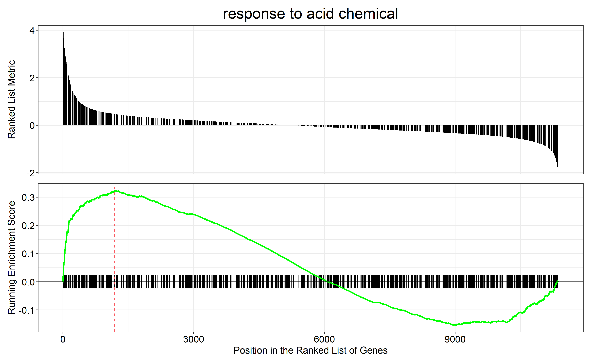
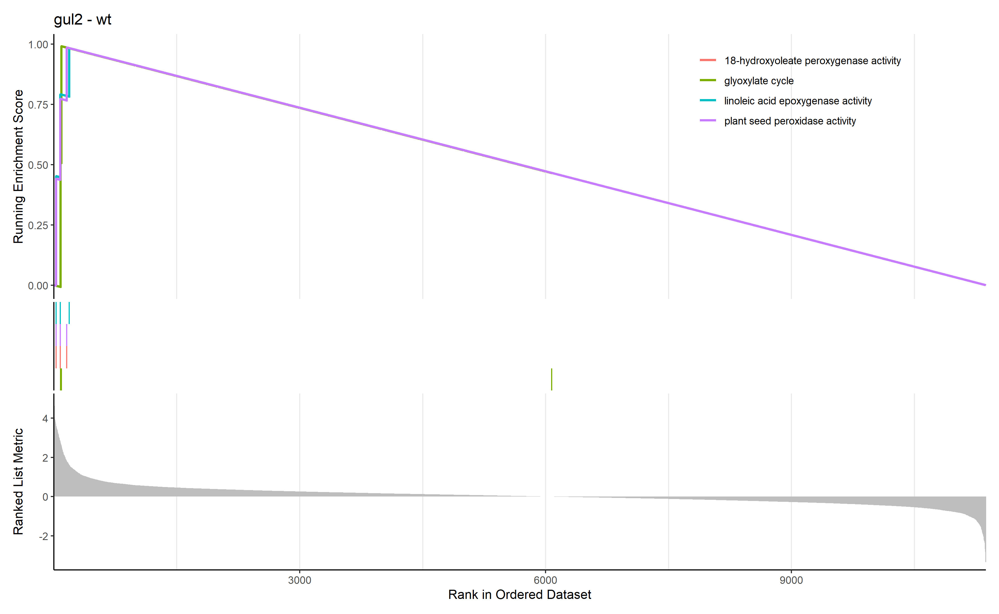
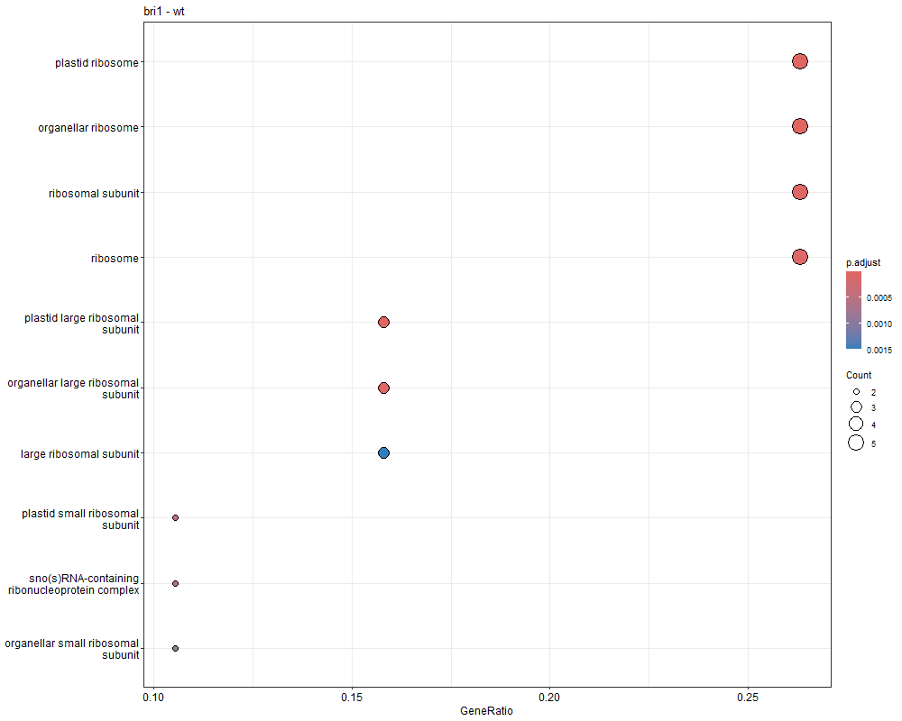
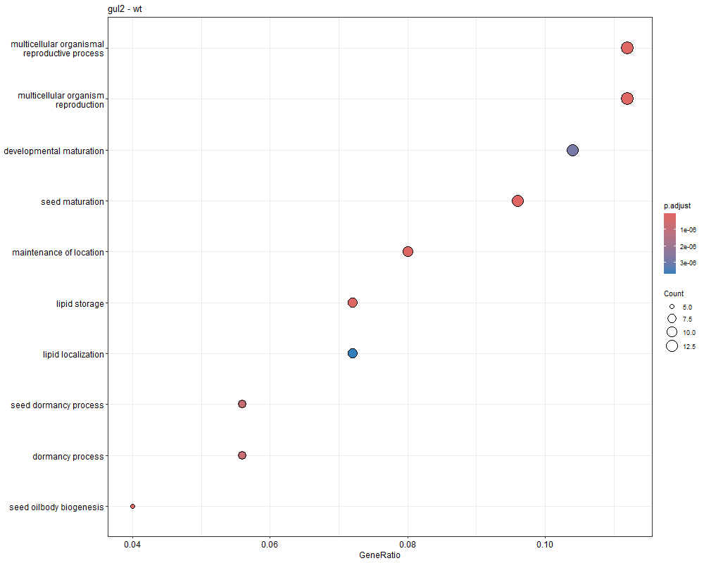

# **生物信息软件综合实践实验报告**

## **实验题目** ：表达谱基本分析及查询

实验日期：2023年12月19日 星期二

实验者：生物信息2102 代子希

## **实验目的：**

1. 熟悉表达谱数据库的查询和数据下载
2. 熟悉芯片表达谱数据分析的一般流程
3. 掌握表达差异分析和基因富集分析的方法
4. 了解常用的数据可视化方法

## **实验内容：**

1. GEO数据库查询和数据下载
2. 使用R包limma进行差异表达分析
3. 使用R包clusterProfiler进行基因富集分析
4. 使用gplots、ggpubr、pheatmap等R包对差异表达和富集分析进行结果可视化

## 实验流程和结果

以 GSE46456为例，该实验使用的芯片平台为GPL198，拟南芥样本基因型包括：野生型、BRI1 单突变型、GUL2单突变型、BRI和GUL 双突变型，每种基因型设置三种重复。研究三种突变型样本与WT野生型样本哪些基因存在显著的差异表达。根据所提供的演示代码和相关文件，请完成以下任务：

1. 对获得的芯片数据进行**数据标准化**、**探针过滤**、**limma差异分析**，写明每一步骤的代码、目的以及中间结果。
2. 运用limma获得突变体和野生型的差异表达基因集，并**阐述差异分析结果的各列含义**。
3. 对所有基因做GSEA富集分析；并对三组**上调的差异表达基因**（bri1-WT、gul2-WT、bri1_gul2-WT）做GO富集分析，并解释富集结果，如有图片请注明图注信息。

安装、加载包以及相关依赖

```R
# R ≥ 3.5.0

if (!requireNamespace("BiocManager", quietly = TRUE))
    install.packages("BiocManager")
BiocManager::install(version = "3.13")

library(BiocManager)
install.packages("cluster")
install.packages("kohonen")
install.packages("gplots")
install.packages("ggpubr")
install.packages("ggthemes")
install.packages("pheatmap")

BiocManager::install("GEOquery")
BiocManager::install("RankProd")
BiocManager::install("affy")
BiocManager::install("affyPLM")
BiocManager::install("limma")
BiocManager::install("genefilter")
BiocManager::install("org.At.tair.db")
BiocManager::install("Mfuzz")
BiocManager::install("clusterProfiler")
```

```R
library(RankProd)
library(cluster)
library(kohonen)
library(gplots)
library(RankProd)
library(affy)
library(affyPLM)
packageurl <- "https://bioconductor.org/packages//2.7/bioc/src/contrib/simpleaffy_2.64.0.tar.gz"
install.packages(packageurl, repos = NULL, type = "source")

library(genefilter)
library(gcrma)

options(BioC_mirror="https://mirrors.tuna.tsinghua.edu.cn/bioconductor")
install.packages("https://github.com/SiYangming/simpleaffy/releases/download/v2.64.0/simpleaffy_2.64.0.tar.gz", repos = NULL, type = "source", dependencies = TRUE)

library(simpleaffy)

library(RColorBrewer)
library(limma)
library(pheatmap)
library(Mfuzz)
library(clusterProfiler)
library(enrichplot)
library(ggplot2)
library("org.At.tair.db",character.only = TRUE)

```

其中simpleaffy

使用源代码安装

```
packageurl <- "https://bioconductor.org/packages/3.8/bioc/src/contrib/simpleaffy_2.58.0.tar.gz"
install.packages(packageurl, repos=NULL, type="source")
```

下载数据

用 `GEOquery` 中 `getGEOSuppFiles()` 函数直接下载，指定下载路径

```R
library(GEOquery)
getGEOSuppFiles("GSE46456", baseDir = "F:/tmp_data")
```

报错

```R
Error in getGEOSuppFiles("GSE46456", baseDir = "F:/tmp_data") :
  Failed to download F:/tmp_data/GSE46456/GSE46456_RAW.tar!
```

也许是网络原因，命令行使用代理也不行，直接到GEO数据库网页端下载芯片数据，在本地解压



```R
#生成文件列表，以便批量导入文件
cels = list.files("./data/GSE46456/",pattern="*.gz",full.names =TRUE)
# 读取CEL文件，将其处理成AffyBatch对象
celfiles <- ReadAffy(filenames=cels)
```

### 数据预处理

```R
# 将AffyBatch对象转换为ExpressionSet对象,对数据进行标准化
celfiles.rma <- rma(celfiles)

Error in getCdfInfo(object) : 
  Could not obtain CDF environment, problems encountered:
Specified environment does not contain ATH1-121501
Library - package ath1121501cdf not installed
Bioconductor - could not connect
此外: Warning message:
In readLines(biocURL) :
  URL 'https://master.bioconductor.org/': status was 'SSL connect error'
```

根据报错安装相关包

```R
if (!requireNamespace("BiocManager", quietly = TRUE))
    install.packages("BiocManager")

BiocManager::install("ath1121501cdf")
```

```R
# 将AffyBatch对象转换为ExpressionSet对象,对数据进行标准化
celfiles.rma <- rma(celfiles)
#?rma
cols <- brewer.pal(8,"Set1")
```

```R
?rma

rma {affy}
Robust Multi-Array Average expression measure
Description
This function converts an AffyBatch object into an ExpressionSet object using the robust multi-array average (RMA) expression measure.
```

```R
pdf("./png/boxplot_celfiles.pdf")
boxplot(celfiles, col=cols)
dev.off()

pdf("./png/boxplot_celfiles_rma.pdf")
boxplot(celfiles.rma, col=cols)
dev.off()

#放在一张图上,对比
pdf("./png/boxplot_celfiles_celfiles_rma.pdf", width=20, height=5)
par(mfrow = c(1,2))
boxplot(celfiles, col=cols, main = "Raw Data")
boxplot(celfiles.rma, col=cols, main = "RMA Data")
par(mfrow = c(1,1))
dev.off()

#密度和对数强度直方图
pdf("./png/hist_celfiles.pdf")
hist(celfiles, col=cols)
dev.off()

pdf("./png/hist_celfiles_rma.pdf")
hist(celfiles.rma, col=cols)
dev.off()
```


对比标准化前后的数据，经过标准化后12个样本的数据分布更趋同

### 探针过滤

```R
#对ExpressionSet的探针进行过滤（过滤掉表达量低的探针），返回一个list
celfiles.filtered <- nsFilter(celfiles.rma, require.entrez=FALSE, remove.dupEntrez=FALSE)
```

```R
#list中的eset为过滤后的ExpressionSet，filter.log为每一步过滤到多少探针的记录
> celfiles.filtered$filter.log
$numLowVar
[1] 11373

$feature.exclude
[1] 64

> celfiles.filtered$eset
ExpressionSet (storageMode: lockedEnvironment)
assayData: 11373 features, 12 samples
  element names: exprs
protocolData
  sampleNames: GSM1130596_Ws-2-1.CEL.gz GSM1130597_Ws-2-2.CEL.gz ...
    GSM1130607_gul2-1bri1-5-3.CEL.gz (12 total)
  varLabels: ScanDate
  varMetadata: labelDescription
phenoData
  sampleNames: GSM1130596_Ws-2-1.CEL.gz GSM1130597_Ws-2-2.CEL.gz ...
    GSM1130607_gul2-1bri1-5-3.CEL.gz (12 total)
  varLabels: sample
  varMetadata: labelDescription
featureData: none
experimentData: use 'experimentData(object)'
Annotation: ath1121501
```

```R
#获得过滤后的表达矩阵
eset <- exprs(celfiles.filtered$eset)
```

表达量矩阵，每一行表示一个探针(基因)，每一列为一个样本

```R
> head(eset)
          GSM1130596_Ws-2-1.CEL.gz GSM1130597_Ws-2-2.CEL.gz
244901_at                 5.224648                 5.428151
244902_at                 5.149407                 5.187442
244903_at                 5.592680                 5.436074
244904_at                 4.985820                 5.072172
244906_at                 5.727308                 5.889640
244912_at                 6.465566                 6.586064
          GSM1130598_Ws-2-3.CEL.gz GSM1130599_bri1-5-1.CEL.gz
244901_at                 5.546510                   4.683135
244902_at                 4.886097                   4.672779
244903_at                 5.638751                   5.562216
244904_at                 5.262937                   5.016912
244906_at                 5.323069                   5.381804
244912_at                 6.814510                   7.653073
          GSM1130600_bri1-5-2.CEL.gz GSM1130601_bri1-5-3.CEL.gz
244901_at                   4.753393                   4.463033
244902_at                   4.805556                   4.794880
244903_at                   5.622267                   5.224591
244904_at                   5.446725                   5.482161
244906_at                   5.609199                   5.514687
244912_at                   7.871753                   8.260488
          GSM1130602_gul2-1-1.CEL.gz GSM1130603_gul2-1-2.CEL.gz
244901_at                   6.087000                   5.868863
244902_at                   5.527636                   5.592619
244903_at                   6.605356                   6.062327
244904_at                   5.366306                   5.495490
244906_at                   6.348055                   6.080350
244912_at                   8.052288                   7.970124
          GSM1130604_gul2-1-3.CEL.gz GSM1130605_gul2-1bri1-5-1.CEL.gz
244901_at                   5.386404                         5.490967
244902_at                   5.927320                         5.302640
244903_at                   5.597098                         6.694592
244904_at                   5.026725                         5.257816
244906_at                   6.218219                         6.613726
244912_at                   7.871955                         7.620157
          GSM1130606_gul2-1bri1-5-2.CEL.gz GSM1130607_gul2-1bri1-5-3.CEL.gz
244901_at                         5.671008                         5.305481
244902_at                         5.524203                         5.494279
244903_at                         6.661931                         6.565135
244904_at                         5.356717                         5.228070
244906_at                         6.537190                         6.425924
244912_at                         7.387385                         7.555005
> colnames(eset)
 [1] "GSM1130596_Ws-2-1.CEL.gz"         "GSM1130597_Ws-2-2.CEL.gz"
 [3] "GSM1130598_Ws-2-3.CEL.gz"         "GSM1130599_bri1-5-1.CEL.gz"
 [5] "GSM1130600_bri1-5-2.CEL.gz"       "GSM1130601_bri1-5-3.CEL.gz"
 [7] "GSM1130602_gul2-1-1.CEL.gz"       "GSM1130603_gul2-1-2.CEL.gz"
 [9] "GSM1130604_gul2-1-3.CEL.gz"       "GSM1130605_gul2-1bri1-5-1.CEL.gz"
[11] "GSM1130606_gul2-1bri1-5-2.CEL.gz" "GSM1130607_gul2-1bri1-5-3.CEL.gz"
```

### 探针注释

注释探针: 防止非特异性结合造成的干扰(会有多个探针检测同一个基因的表达)。

先对探针进行注释，确定每个探针对应检测哪个基因的表达，然后再合并重复探针

```R
ara_anno <- read.delim("./data/affy_ATH1_array_elements-2010-12-20.txt")
ids <- match(rownames(eset), ara_anno$array_element_name)

rownames(eset) <- ara_anno$locus[ids]
colnames(eset) <- sub(".CEL.gz","",colnames(eset))
```

规范矩阵的行名和列名

```R
> head(eset)
                    GSM1130596_Ws-2-1 GSM1130597_Ws-2-2 GSM1130598_Ws-2-3
ATMG00640                    5.224648          5.428151          5.546510
ATMG00650                    5.149407          5.187442          4.886097
ATMG00660                    5.592680          5.436074          5.638751
ATMG00670                    4.985820          5.072172          5.262937
ATMG00690                    5.727308          5.889640          5.323069
AT2G07783;ATMG00830          6.465566          6.586064          6.814510
                    GSM1130599_bri1-5-1 GSM1130600_bri1-5-2 GSM1130601_bri1-5-3
ATMG00640                      4.683135            4.753393            4.463033
ATMG00650                      4.672779            4.805556            4.794880
ATMG00660                      5.562216            5.622267            5.224591
ATMG00670                      5.016912            5.446725            5.482161
ATMG00690                      5.381804            5.609199            5.514687
AT2G07783;ATMG00830            7.653073            7.871753            8.260488
                    GSM1130602_gul2-1-1 GSM1130603_gul2-1-2 GSM1130604_gul2-1-3
ATMG00640                      6.087000            5.868863            5.386404
ATMG00650                      5.527636            5.592619            5.927320
ATMG00660                      6.605356            6.062327            5.597098
ATMG00670                      5.366306            5.495490            5.026725
ATMG00690                      6.348055            6.080350            6.218219
AT2G07783;ATMG00830            8.052288            7.970124            7.871955
                    GSM1130605_gul2-1bri1-5-1 GSM1130606_gul2-1bri1-5-2
ATMG00640                            5.490967                  5.671008
ATMG00650                            5.302640                  5.524203
ATMG00660                            6.694592                  6.661931
ATMG00670                            5.257816                  5.356717
ATMG00690                            6.613726                  6.537190
AT2G07783;ATMG00830                  7.620157                  7.387385
                    GSM1130607_gul2-1bri1-5-3
ATMG00640                            5.305481
ATMG00650                            5.494279
ATMG00660                            6.565135
ATMG00670                            5.228070
ATMG00690                            6.425924
AT2G07783;ATMG00830                  7.555005
```

### limma差异分析

构建分组矩阵

```R
group_list = c(rep("wt",3), rep("bri1",3), rep("gul2",3), rep("gul_bri",3))
design <- model.matrix(~0+factor(group_list))

colnames(design) <- levels(factor(group_list))
rownames(design) <- colnames(eset)
```

构建分组矩阵，和野生型作比较

```R
contrast.matrix<- makeContrasts(bri1-wt, gul2-wt, gul_bri-wt,levels =design)
contrast.matrix
```

limma三部曲：线性模型拟合  根据对比模型进行差值计算 贝叶斯检验

```R
#limma"三部曲"
fit1 <- lmFit(eset,design)#线性模型拟合
fit2 <- contrasts.fit(fit1,contrast.matrix)#根据对比模型进行差值计算
fit2 <- eBayes(fit2)#贝叶斯检验
```

输出差异表达基因

```R
#利用toptable 导出DEG结果
limma_results <- lapply(colnames(contrast.matrix),function(x){topTable(fit2,coef=x,adjust="fdr",sort.by="logFC",number=Inf)})
length(limma_results)
names(limma_results) <- colnames(contrast.matrix) #对导出的结果标记title信息
head(limma_results[[1]])
save(limma_results,file="./data/limma_compare_res.RData")
#对每对比较的样本对DEG结果单独导出DEG信息6
for (n in names(limma_results)){
        write.table(limma_results[[n]],file = sprintf("%s.tsv",paste0("./data/", gsub(" ","",n))),row.names =FALSE,sep="\t")
}
save(eset,file="./data/eset.RData")
```

差异分析结果解释

一共有三组结果，去循环最后一个文件查看

```R
> n   
[1] "gul_bri - wt"
> colnames(limma_results[[n]])
[1] "ID"        "logFC"     "AveExpr"   "t"         "P.Value"   "adj.P.Val"
[7] "B"

```

```R
> head(limma_results[[n]])  
            ID    logFC   AveExpr        t      P.Value    adj.P.Val        B
2773 AT5G12030 4.279782  8.119452 41.36505 1.465057e-20 1.666210e-16 37.01501
9250 AT2G40170 4.106650  7.424729 39.00006 4.589678e-20 2.609920e-16 35.95876
1669 AT5G54190 3.931407  8.501771 35.62676 2.644989e-19 5.013576e-16 34.31203
6603 AT3G15670 3.917131  7.540334 35.89093 2.292873e-19 5.013576e-16 34.44747
9416 AT2G21490 3.909309  6.788934 31.58778 2.697592e-18 2.045314e-15 32.08537
46   ATCG00790 3.901580 10.302096 34.51467 4.882151e-19 7.932100e-16 33.72882
```

* **ID** : Gene ID
* **logFC** : 两组表达值之间以2为底对数化的变化倍数（Fold change, FC），由于基因表达矩阵本身已经取了对数，这里是两组基因表达值均值之差
* **AveExpr** ：该探针组所在所有样品中的平均表达值
* **t** ：贝叶斯调整后的两组表达值间 T 检验中的 t 统计量
* **P.Value** : 检验P值
* **adj.P.Val** ：调整后的 P 值（多重检验BH等方法）
* **B** ：是经验贝叶斯得到的标准差的对数化值

### 差异表达分析结果可视化

热图

```R
pdf("./png/heatmap.pdf")
pheatmap(eset, col=c(colorRampPalette(brewer.pal(9,"Blues")[7:2])(100),colorRampPalette(brewer.pal(9,"Reds")[2:7])(100)),border_color=NA,cluster_rows=T,cluster_cols=T,show_rownames=F,show_colnames=T,angle_col=315,fontsize=13,main="expression",display_numbers=F)
dev.off()
```

颜色的深浅来反映数值的高低，聚类反映不同基因和不同样本之间的表达量相似性


火山图

```
library(ggpubr)
library(ggthemes)
for (n in names(limma_results)){
    file_name = sprintf("%s.tsv",paste0("./data/", gsub(" ","",n)))
    deg.data <- read.table(file_name,header=T, sep="\t")
    deg.data$logP <- -log10(deg.data$adj.P.Val)
    deg.data$Group = "not-significant" #定义Group列
    deg.data$Group[which ((deg.data$adj.P.Val < 0.05) & (deg.data$logFC > 2))] = "up-regulated" #定义DEG标准
    deg.data$Group[which ((deg.data$adj.P.Val < 0.05) & (deg.data$logFC < -2))] = "down-regulated" #定义DEG标准
    table(deg.data$Group)
    pdf(sprintf("./png/%s.pdf",paste0(gsub(" ","",n))))
    ggscatter(deg.data, x="logFC",y = "logP",color = "Group")  + theme_base() + labs(title = n)
    dev.off()
}
```



```R
#新加一列lable
deg.data$Lable = "" 
#对差异表达基因P值从小到大排序
deg.data <- deg.data[order(deg.data$adj.P.Val),] 
#从高表达基因中选取adj.P.Val最显著的10个基因
up.genes <- head(deg.data$ID[which(deg.data$Group == "up-regulated")],10)
#从低表达基因中选取adj.P.Val最显著的10个基因
down.genes <- head(deg.data$ID[which(deg.data$Group == "down-regulated")],10)
# 讲上两步选取的显著基因合并并加入到lable中
deg.top10.genes <- c(as.character(up.genes), as.character(down.genes) )
deg.data$Lable[match(deg.top10.genes, deg.data$ID)] <- deg.top10.genes
png("./png/plot2.png", res = 300, width = 10, height = 10, units = "in")
ggscatter(deg.data, x="logFC", y = "logP", color = "Group", palette = c("#2f5688", "#BBBBBB", "#CC0000"), size = 1, label = deg.data$Lable, font.label = 8, repel = T, xlab = "Log2FoldChange", ylab="-Log10(Adjust P-value)",) + theme_base() + geom_hline(yintercept = 1.30, linetype="dashed") + geom_vline(xintercept = c(-2,2), linetype="dashed")
dev.off()
```



富集分析

首先进行GSEA

```R

for (n in names(limma_results)){
  file_name <- sprintf('%s.tsv', paste0("./data/", gsub(" ", "", n)))
  GSEA_data <- read.table(file_name, header = T, sep = "\t")
  GSEA_gene_lists <- GSEA_data$logFC #提取表达量变化值
  names(GSEA_gene_lists) <- GSEA_data$ID #给提取出来的值赋予ID
  GSEA_gene_lists <- sort(GSEA_gene_lists, decreasing = TRUE)#降序排列

  organisms <- get("org.At.tair.db") #获取拟南芥数据库信息
  #GSEA富集分析
  GSEA_GO_Result <-
    gseGO(
      geneList = GSEA_gene_lists,
      ont = "ALL",
      keyType = "TAIR",
      nPerm = 10000,
      minGSSize = 3,
      maxGSSize = 800,
      pvalueCutoff = 0.05,
      verbose = TRUE,
      OrgDb = organisms ,
      pAdjustMethod = "none"
    )
  Sort_GO_result <- GSEA_GO_Result[order(GSEA_GO_Result$enrichmentScore, decreasing = T),]
  write.table(Sort_GO_result,paste(file_name,'GSEA_GO_Result.txt',sep = '_'),sep = "\t",quote = F,col.names = T,row.names = F)

  GSEA_GO_Result_plot <- gseaplot2(GSEA_GO_Result, row.names(Sort_GO_result)[1:4], title = n)
  png(filename = paste(file_name,'GSEA_GO_Result.png',sep = '_'),width = 3580,height = 2200,res = 300)
  print(GSEA_GO_Result_plot)
  dev.off()
  GSEA_GO_Result_plot2 <- gseaplot(GSEA_GO_Result,by="all",title = GSEA_GO_Result$Description[1],geneSetID=1)
  png(filename = paste(file_name,'GSEA_GO_Result2.png',sep = '_'),width = 3580,height = 2200,res = 300)
  print(GSEA_GO_Result_plot2)
  dev.off()
}
```

通过 `row.names(Sort_GO_result)[1:4]`指定每一组中富集分数最高的四个term画富集条码图







对三组上调的差异表达基因（bri1-WT、gul2-WT、bri1_gul2-WT）做GO富集分析

```R
for (n in names(limma_results)){
  file_name <- sprintf('%s.tsv',paste0("./data/", gsub(" ", "", n)))
  deg.data <- read.table(file_name, header = T, sep = "\t")
  deg.data$logP <- -log10(deg.data$adj.P.Val) #-log10值转换
  deg.data$Group = "not-significant" #定义Group列
  deg.data$Group[which ((deg.data$adj.P.Val < 0.05) & (deg.data$logFC > 2))] = "up-regulated" #定义DEG标准
  deg.data$Group[which ((deg.data$adj.P.Val < 0.05) & (deg.data$logFC < -2))] = "down-regulated" #定义DEG标准
  data<- deg.data[deg.data$Group=="up-regulated",]
  ego <- enrichGO(gene = data$ID,keyType = "TAIR",OrgDb=organisms,ont="ALL",pAdjustMethod="BH",qvalueCutoff=0.05)
  png(file = paste(file_name,'GO_dot.png',sep = '_'),bg="transparent",width=1000,height=800)
  GO_dot <- dotplot(ego,showCategory=10)+ ggtitle(n)
  print(GO_dot)
  dev.off()
}
```



## 思考与讨论

1.为什么要对探针信号或基因表达量取对数？为什么是log2不是log10或lg?

* 在芯片数据分析中，对探针信号或基因表达量取对数是为了减小数据的离散程度，使得数据更加符合正态分布。取对数后，数据的性质和相对关系不会受到影响。
* 用log2，因为基因表达量增加1倍被认为就可以造成生物学上的一些变化，而且如果前面是对表达量取log2，后面计算fold-chage就可以直接相减。

2.为什么要设置生物学重复？

由于遗传和环境等因素的影响会引起有机体的个体差异，因此需要采用生物重复的实验设计方法来消除该差异。对同一个处理组中独立来源的多个样本分别进行独立测定分析，是整个实验的完全重复。设计生物重复可以：

* 能够消除组内误差：生物学重复可以测量变异程度；
* 增强结果的可靠性：测序的样本数越多，越能够降低背景差异；
* 检测离群样本：异常样本的存在，会严重影响测序结果的准确性，通过计算样本间的相关性可以发现异常样本，将其排除。

3.芯片数据差异表达分析和富集分析中，分别需要用到哪些算法、统计模型和检验？

在芯片数据差异表达分析中，常用的算法和统计模型包括：

* 倍数分析方法：倍数变换fold change，单纯的case与control组表达值相比较，对没有重复实验样本的芯片数据，或者双通道数据采用这种方法。
* 参数法分析（t检验）：当t超过根据可信度选择的标准时, 比较的两样本被认为存在着差异。但小样本基因芯片实验会导致不可信的变异估计，此时采用调节性T检验。
* 非参数分析：由于微阵列数据存在“噪声”干扰而且不满足正态分布假设，用t检验有风险。非参数检验并不要求数据满足特殊

在富集分析中，常用的统计方法包括累计超几何分布和Fisher精确检验。由于在进行富集分析时通常需要同时进行大量检验（多重检验），所以需要采用多重检验校正的方法对检验结果进行校正，常用的校正方法包括Bonferroni校正和Benjiamini false discovery rate校正。
