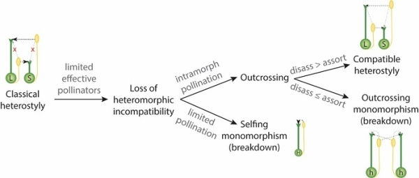

## 项目介绍

植物的自交不亲和性有许多原因，其中本项目所关注的异型花柱是其中之一，这种花的多态性结构至少出现在28个被子植物科中，准备搜集研究其中公共数据库中已有相关植物的基因组，对这些植物的基因组进行比较分析、共线性分析等，其中可以特别关注比较s位点上的超基因，去研究这些植物自交不亲和的差异以及相似性，帮助理解这些植物基因组的演化关系，以及s位点上的超基因的演化动态。

### 自交不亲和性（SI）Self-incompatibility

#### 概念^1^

陆地生物占地球生物总数的85%，其多样性与被子植物的起源和扩张密切相关。被子植物约有20多万种，是植物界最大的类群，但其形成和扩张的原因仍为未解之谜。现存被子植物中，约40%具有自交不亲和性 (Self-incompatibility, SI)。**SI是一种正常可育的雌雄同花被子植物自花授粉后不能产生合子的现象**，对于促进其异交并增加其多样性至关重要。

被子植物在进化过程中，由于受到起伏不定的来自自交或异交的选择压力，其SI会发生频繁的丢失和重获。在真双子叶植物中，目前共发现四类不同分子机制的SI，包括常见于车前科、茄科、蔷薇科和芸香科的1类、十字花科的2类、罂粟科的3类和报春花科的4类SI。

#### 概念

据现有研究表明异型花柱多态性是一种由**超基因(S-locus supergen)**控制的花形态结构的多样性,其表现在群体中有两种或者三种雌雄蕊相互异位的花。这种花的多态性结构至少出现在28个被子植物科中，主要是为促进异交授粉、提高花粉传递精确性。^2^

由于基因突变以及生物因子（如传粉者）和非生物因子的共同作用，有时异型花柱多态性结构难以稳定维持，在群体间和群体内产生极大变异，最终促进植物交配系统的多样性演化,如上图所示。

#### 背景

## 参考

1.[被子植物自交不亲和性起源、丢失和重获的高度动态进化机制 (baidu.com)](https://baijiahao.baidu.com/s?id=1715591836205248994)

2.[华南植物园等在异型花柱植物的交配多样性演化研究中获进展----中国科学院 (cas.cn)](https://www.cas.cn/syky/202301/t20230119_4872922.shtml)

2.[武汉植物园在植物异型花柱分子遗传调控机制研究中取得新进展 (qq.com)](https://mp.weixin.qq.com/s/PSVMjaIelvQ2C-UFYTYPxg)

This document talks about:

* **异型花柱的研究进展** ：中国科学院武汉植物园和多伦多大学的研究团队合作，以**金银莲花**为模式植物，揭示了**异型花柱**的分子遗传调控机制，为理解植物性状多样性和演化提供了新的视角。
* [ **基因组测序和关联分析** ：研究团队构建了高质量的 **单倍型基因组** ，并通过**全基因组关联分析**发现了控制金银莲花异型花柱的 **S位点超基因** ，该超基因由三个紧密连锁的基因组成，分别控制花柱长度或雄蕊高度等特征。](https://edgeservices.bing.com/edgesvc/chat?udsframed=1&form=SHORUN&clientscopes=chat,noheader,udsedgeshop,channelstable,&shellsig=c9319c1362f174328caba0ccd86eeb602e77691b&setlang=zh-CN&darkschemeovr=1#sjevt%7CDiscover.Chat.SydneyClickPageCitation%7Cadpclick%7C0%7C243f6e35-ebcf-4a08-b365-3c5411119c0a%7C%7B%22sourceAttributions%22%3A%7B%22providerDisplayName%22%3A%22%E5%BC%82%E5%9E%8B%E8%8A%B1%E6%9F%B1%E5%9C%A8%E9%81%97%E4%BC%A0%E4%B8%8A%E6%98%AF%E7%94%B1...%22%2C%22pageType%22%3A%22html%22%2C%22pageIndex%22%3A1%2C%22relatedPageUrl%22%3A%22https%253A%252F%252Fmp.weixin.qq.com%252Fs%252FPSVMjaIelvQ2C-UFYTYPxg%22%2C%22lineIndex%22%3A6%2C%22highlightText%22%3A%22%E5%BC%82%E5%9E%8B%E8%8A%B1%E6%9F%B1%E5%9C%A8%E9%81%97%E4%BC%A0%E4%B8%8A%E6%98%AF%E7%94%B1S%E4%BD%8D%E7%82%B9%E5%86%B3%E5%AE%9A%E7%9A%84%EF%BC%8CS%E4%BD%8D%E7%82%B9%E6%98%AF%E4%B8%80%E4%B8%AA%E8%B6%85%E5%9F%BA%E5%9B%A0%EF%BC%8C%E7%94%B1%E5%A4%9A%E4%B8%AA%E7%B4%A7%E5%AF%86%E8%BF%9E%E9%94%81%E7%9A%84%E5%9F%BA%E5%9B%A0%E7%BB%84%E6%88%90%EF%BC%8C%E8%BF%99%E4%BA%9B%E5%9F%BA%E5%9B%A0%E5%88%86%E5%88%AB%E6%8E%A7%E5%88%B6%E8%8A%B1%E6%9F%B1%E9%95%BF%E5%BA%A6%E6%88%96%E9%9B%84%E8%95%8A%E9%AB%98%E5%BA%A6%E7%AD%89%E7%89%B9%E5%BE%81%E3%80%82%22%2C%22snippets%22%3A%5B%5D%7D%7D)[^1^](https://edgeservices.bing.com/edgesvc/chat?udsframed=1&form=SHORUN&clientscopes=chat,noheader,udsedgeshop,channelstable,&shellsig=c9319c1362f174328caba0ccd86eeb602e77691b&setlang=zh-CN&darkschemeovr=1#sjevt%7CDiscover.Chat.SydneyClickPageCitation%7Cadpclick%7C0%7C243f6e35-ebcf-4a08-b365-3c5411119c0a%7C%7B%22sourceAttributions%22%3A%7B%22providerDisplayName%22%3A%22%E5%BC%82%E5%9E%8B%E8%8A%B1%E6%9F%B1%E5%9C%A8%E9%81%97%E4%BC%A0%E4%B8%8A%E6%98%AF%E7%94%B1...%22%2C%22pageType%22%3A%22html%22%2C%22pageIndex%22%3A1%2C%22relatedPageUrl%22%3A%22https%253A%252F%252Fmp.weixin.qq.com%252Fs%252FPSVMjaIelvQ2C-UFYTYPxg%22%2C%22lineIndex%22%3A6%2C%22highlightText%22%3A%22%E5%BC%82%E5%9E%8B%E8%8A%B1%E6%9F%B1%E5%9C%A8%E9%81%97%E4%BC%A0%E4%B8%8A%E6%98%AF%E7%94%B1S%E4%BD%8D%E7%82%B9%E5%86%B3%E5%AE%9A%E7%9A%84%EF%BC%8CS%E4%BD%8D%E7%82%B9%E6%98%AF%E4%B8%80%E4%B8%AA%E8%B6%85%E5%9F%BA%E5%9B%A0%EF%BC%8C%E7%94%B1%E5%A4%9A%E4%B8%AA%E7%B4%A7%E5%AF%86%E8%BF%9E%E9%94%81%E7%9A%84%E5%9F%BA%E5%9B%A0%E7%BB%84%E6%88%90%EF%BC%8C%E8%BF%99%E4%BA%9B%E5%9F%BA%E5%9B%A0%E5%88%86%E5%88%AB%E6%8E%A7%E5%88%B6%E8%8A%B1%E6%9F%B1%E9%95%BF%E5%BA%A6%E6%88%96%E9%9B%84%E8%95%8A%E9%AB%98%E5%BA%A6%E7%AD%89%E7%89%B9%E5%BE%81%E3%80%82%22%2C%22snippets%22%3A%5B%5D%7D%7D)
* [ **S位点基因的功能和演化** ：研究团队探讨了S位点基因及其调控网络的潜在功能，以及**转座元件**和**逐步基因复制**对异型花柱超基因演化可能起到的作用。](https://edgeservices.bing.com/edgesvc/chat?udsframed=1&form=SHORUN&clientscopes=chat,noheader,udsedgeshop,channelstable,&shellsig=c9319c1362f174328caba0ccd86eeb602e77691b&setlang=zh-CN&darkschemeovr=1#sjevt%7CDiscover.Chat.SydneyClickPageCitation%7Cadpclick%7C1%7C243f6e35-ebcf-4a08-b365-3c5411119c0a%7C%7B%22sourceAttributions%22%3A%7B%22providerDisplayName%22%3A%22%E8%AF%A5%E7%A0%94%E7%A9%B6%E8%BF%98%E6%8E%A2%E8%AE%A8%E4%BA%86S%E4%BD%8D%E7%82%B9...%22%2C%22pageType%22%3A%22html%22%2C%22pageIndex%22%3A1%2C%22relatedPageUrl%22%3A%22https%253A%252F%252Fmp.weixin.qq.com%252Fs%252FPSVMjaIelvQ2C-UFYTYPxg%22%2C%22lineIndex%22%3A12%2C%22highlightText%22%3A%22%E8%AF%A5%E7%A0%94%E7%A9%B6%E8%BF%98%E6%8E%A2%E8%AE%A8%E4%BA%86S%E4%BD%8D%E7%82%B9%E5%9F%BA%E5%9B%A0%E5%8F%8A%E5%85%B6%E8%B0%83%E6%8E%A7%E7%BD%91%E7%BB%9C%E7%9A%84%E6%BD%9C%E5%9C%A8%E5%8A%9F%E8%83%BD%EF%BC%8C%E4%BB%A5%E5%8F%8A%E8%BD%AC%E5%BA%A7%E5%85%83%E4%BB%B6%E5%92%8C%E9%80%90%E6%AD%A5%E5%9F%BA%E5%9B%A0%E5%A4%8D%E5%88%B6%E5%AF%B9%E5%BC%82%E5%9E%8B%E8%8A%B1%E6%9F%B1%E8%B6%85%E5%9F%BA%E5%9B%A0%E6%BC%94%E5%8C%96%E5%8F%AF%E8%83%BD%E8%B5%B7%E5%88%B0%E7%9A%84%E4%BD%9C%E7%94%A8%E3%80%82%22%2C%22snippets%22%3A%5B%5D%7D%7D)[^2^](https://edgeservices.bing.com/edgesvc/chat?udsframed=1&form=SHORUN&clientscopes=chat,noheader,udsedgeshop,channelstable,&shellsig=c9319c1362f174328caba0ccd86eeb602e77691b&setlang=zh-CN&darkschemeovr=1#sjevt%7CDiscover.Chat.SydneyClickPageCitation%7Cadpclick%7C1%7C243f6e35-ebcf-4a08-b365-3c5411119c0a%7C%7B%22sourceAttributions%22%3A%7B%22providerDisplayName%22%3A%22%E8%AF%A5%E7%A0%94%E7%A9%B6%E8%BF%98%E6%8E%A2%E8%AE%A8%E4%BA%86S%E4%BD%8D%E7%82%B9...%22%2C%22pageType%22%3A%22html%22%2C%22pageIndex%22%3A1%2C%22relatedPageUrl%22%3A%22https%253A%252F%252Fmp.weixin.qq.com%252Fs%252FPSVMjaIelvQ2C-UFYTYPxg%22%2C%22lineIndex%22%3A12%2C%22highlightText%22%3A%22%E8%AF%A5%E7%A0%94%E7%A9%B6%E8%BF%98%E6%8E%A2%E8%AE%A8%E4%BA%86S%E4%BD%8D%E7%82%B9%E5%9F%BA%E5%9B%A0%E5%8F%8A%E5%85%B6%E8%B0%83%E6%8E%A7%E7%BD%91%E7%BB%9C%E7%9A%84%E6%BD%9C%E5%9C%A8%E5%8A%9F%E8%83%BD%EF%BC%8C%E4%BB%A5%E5%8F%8A%E8%BD%AC%E5%BA%A7%E5%85%83%E4%BB%B6%E5%92%8C%E9%80%90%E6%AD%A5%E5%9F%BA%E5%9B%A0%E5%A4%8D%E5%88%B6%E5%AF%B9%E5%BC%82%E5%9E%8B%E8%8A%B1%E6%9F%B1%E8%B6%85%E5%9F%BA%E5%9B%A0%E6%BC%94%E5%8C%96%E5%8F%AF%E8%83%BD%E8%B5%B7%E5%88%B0%E7%9A%84%E4%BD%9C%E7%94%A8%E3%80%82%22%2C%22snippets%22%3A%5B%5D%7D%7D)[研究结果表明，**油菜素内酯**和**PIF分子调控网络**在金银莲花异型花柱的发育过程中具有重要的作用，为分子层面上异型花柱的趋同演化提供了进一步的证据。](https://edgeservices.bing.com/edgesvc/chat?udsframed=1&form=SHORUN&clientscopes=chat,noheader,udsedgeshop,channelstable,&shellsig=c9319c1362f174328caba0ccd86eeb602e77691b&setlang=zh-CN&darkschemeovr=1#sjevt%7CDiscover.Chat.SydneyClickPageCitation%7Cadpclick%7C2%7C243f6e35-ebcf-4a08-b365-3c5411119c0a%7C%7B%22sourceAttributions%22%3A%7B%22providerDisplayName%22%3A%22%E5%90%8C%E6%97%B6%EF%BC%8C%E7%A0%94%E7%A9%B6%E5%8F%91%E7%8E%B0%E6%B2%B9%E8%8F%9C%E7%B4%A0...%22%2C%22pageType%22%3A%22html%22%2C%22pageIndex%22%3A1%2C%22relatedPageUrl%22%3A%22https%253A%252F%252Fmp.weixin.qq.com%252Fs%252FPSVMjaIelvQ2C-UFYTYPxg%22%2C%22lineIndex%22%3A12%2C%22highlightText%22%3A%22%E5%90%8C%E6%97%B6%EF%BC%8C%E7%A0%94%E7%A9%B6%E5%8F%91%E7%8E%B0%E6%B2%B9%E8%8F%9C%E7%B4%A0%E5%86%85%E9%85%AF%E5%9C%A8%E9%87%91%E9%93%B6%E8%8E%B2%E8%8A%B1%E5%BC%82%E5%9E%8B%E8%8A%B1%E6%9F%B1%E7%9A%84%E5%8F%91%E8%82%B2%E8%BF%87%E7%A8%8B%E4%B8%AD%E5%85%B7%E6%9C%89%E9%87%8D%E8%A6%81%E7%9A%84%E4%BD%9C%E7%94%A8%EF%BC%8C%E5%B9%B6%E4%B8%94PIF%20%EF%BC%88phytochrome-interacting%20factor%EF%BC%8C%E5%85%89%E6%95%8F%E8%89%B2%E7%B4%A0%E4%BA%92%E4%BD%9C%E5%9B%A0%E5%AD%90%EF%BC%89%E5%88%86%E5%AD%90%E8%B0%83%E6%8E%A7%E7%BD%91%E7%BB%9C%E5%9C%A8%E9%9B%84%E8%95%8A%E4%B8%AD%E6%98%BE%E8%91%97%E5%AF%8C%E9%9B%86%EF%BC%8C%E4%B8%BA%E5%88%86%E5%AD%90%E5%B1%82%E9%9D%A2%E4%B8%8A%E5%BC%82%E5%9E%8B%E8%8A%B1%E6%9F%B1%E7%9A%84%E8%B6%8B%E5%90%8C%E6%BC%94%E5%8C%96%E6%8F%90%E4%BE%9B%E4%BA%86%E8%BF%9B%E4%B8%80%E6%AD%A5%E7%9A%84%E8%AF%81%E6%8D%AE%EF%BC%88%E5%9B%BE4%EF%BC%89%E3%80%82%22%2C%22snippets%22%3A%5B%5D%7D%7D)[^3^](https://edgeservices.bing.com/edgesvc/chat?udsframed=1&form=SHORUN&clientscopes=chat,noheader,udsedgeshop,channelstable,&shellsig=c9319c1362f174328caba0ccd86eeb602e77691b&setlang=zh-CN&darkschemeovr=1#sjevt%7CDiscover.Chat.SydneyClickPageCitation%7Cadpclick%7C2%7C243f6e35-ebcf-4a08-b365-3c5411119c0a%7C%7B%22sourceAttributions%22%3A%7B%22providerDisplayName%22%3A%22%E5%90%8C%E6%97%B6%EF%BC%8C%E7%A0%94%E7%A9%B6%E5%8F%91%E7%8E%B0%E6%B2%B9%E8%8F%9C%E7%B4%A0...%22%2C%22pageType%22%3A%22html%22%2C%22pageIndex%22%3A1%2C%22relatedPageUrl%22%3A%22https%253A%252F%252Fmp.weixin.qq.com%252Fs%252FPSVMjaIelvQ2C-UFYTYPxg%22%2C%22lineIndex%22%3A12%2C%22highlightText%22%3A%22%E5%90%8C%E6%97%B6%EF%BC%8C%E7%A0%94%E7%A9%B6%E5%8F%91%E7%8E%B0%E6%B2%B9%E8%8F%9C%E7%B4%A0%E5%86%85%E9%85%AF%E5%9C%A8%E9%87%91%E9%93%B6%E8%8E%B2%E8%8A%B1%E5%BC%82%E5%9E%8B%E8%8A%B1%E6%9F%B1%E7%9A%84%E5%8F%91%E8%82%B2%E8%BF%87%E7%A8%8B%E4%B8%AD%E5%85%B7%E6%9C%89%E9%87%8D%E8%A6%81%E7%9A%84%E4%BD%9C%E7%94%A8%EF%BC%8C%E5%B9%B6%E4%B8%94PIF%20%EF%BC%88phytochrome-interacting%20factor%EF%BC%8C%E5%85%89%E6%95%8F%E8%89%B2%E7%B4%A0%E4%BA%92%E4%BD%9C%E5%9B%A0%E5%AD%90%EF%BC%89%E5%88%86%E5%AD%90%E8%B0%83%E6%8E%A7%E7%BD%91%E7%BB%9C%E5%9C%A8%E9%9B%84%E8%95%8A%E4%B8%AD%E6%98%BE%E8%91%97%E5%AF%8C%E9%9B%86%EF%BC%8C%E4%B8%BA%E5%88%86%E5%AD%90%E5%B1%82%E9%9D%A2%E4%B8%8A%E5%BC%82%E5%9E%8B%E8%8A%B1%E6%9F%B1%E7%9A%84%E8%B6%8B%E5%90%8C%E6%BC%94%E5%8C%96%E6%8F%90%E4%BE%9B%E4%BA%86%E8%BF%9B%E4%B8%80%E6%AD%A5%E7%9A%84%E8%AF%81%E6%8D%AE%EF%BC%88%E5%9B%BE4%EF%BC%89%E3%80%82%22%2C%22snippets%22%3A%5B%5D%7D%7D)
